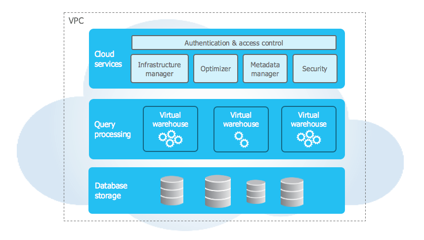
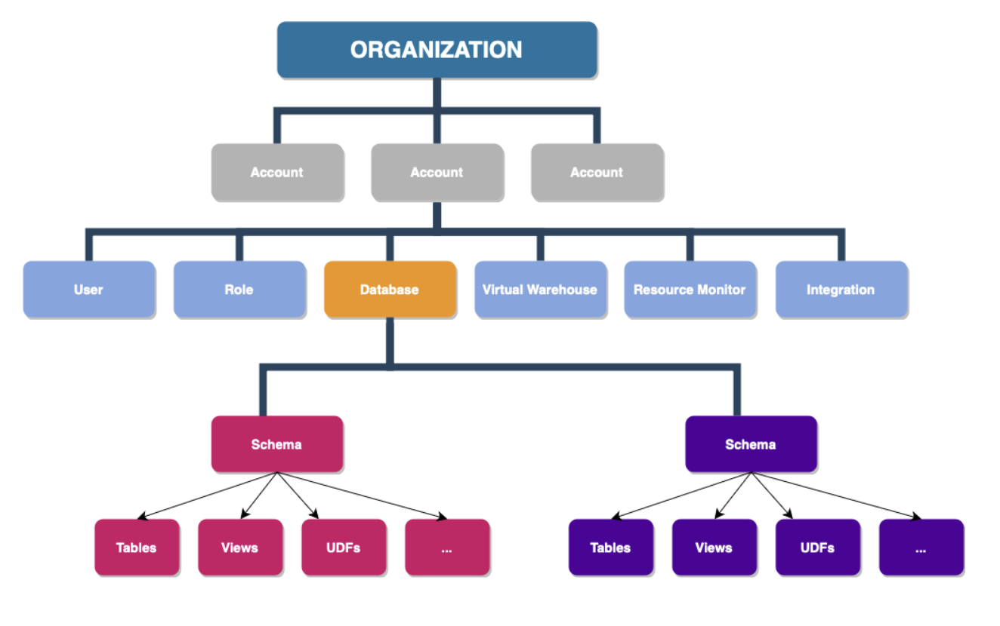
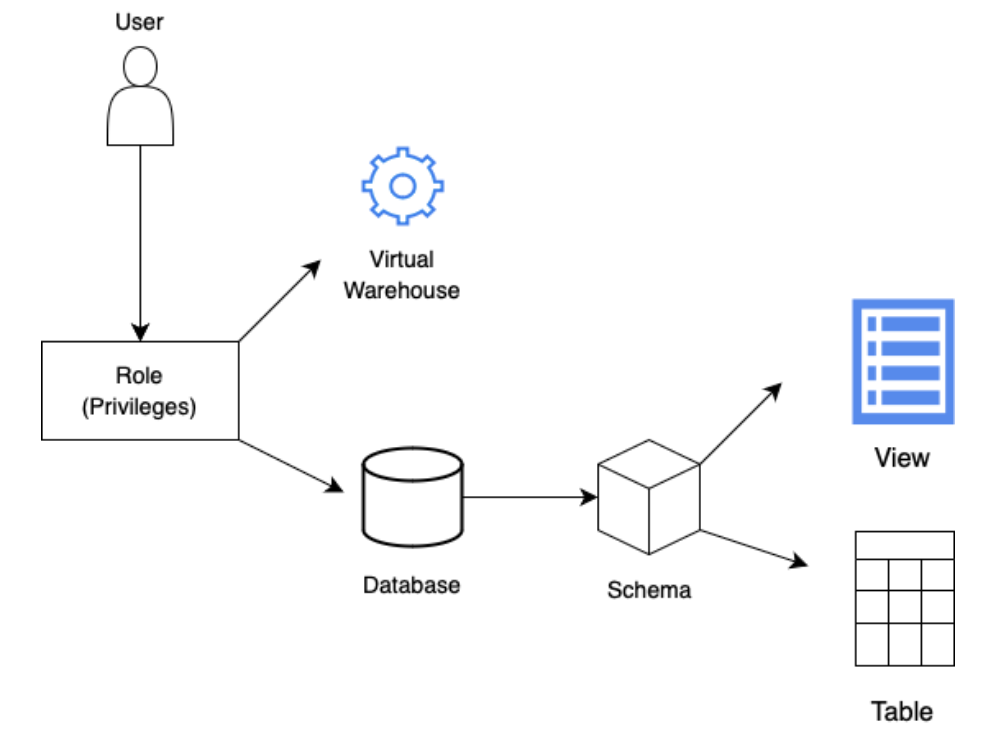
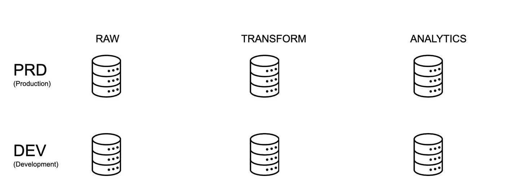
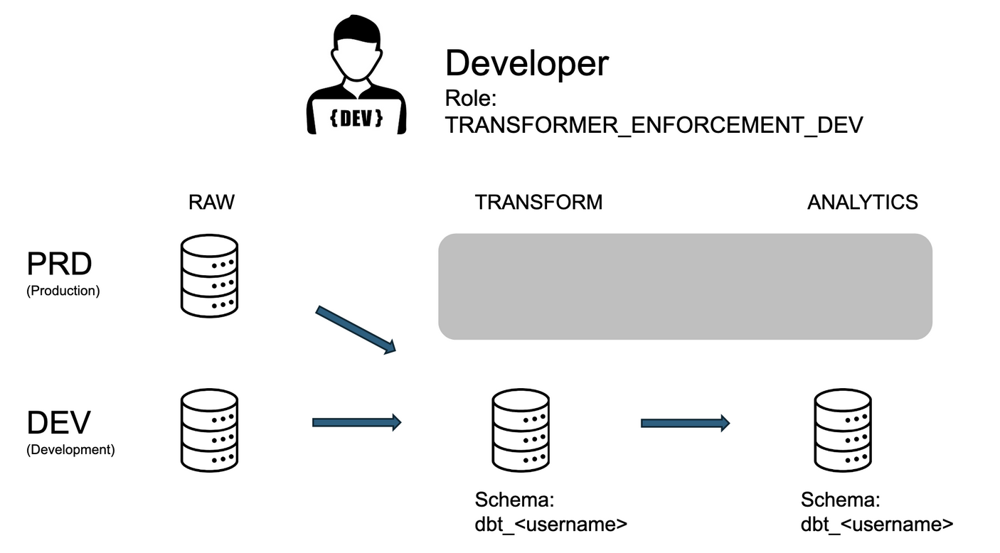
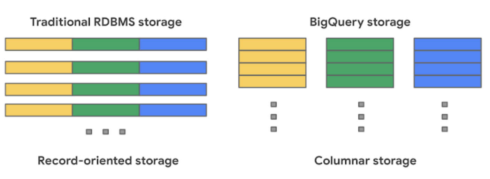

# Snowflake training

## Training overview

This training is intended to give a very high overview of how to interact with key functionality in Snowflake. The training is split into two days, each day has approx. 90 minutes of content (a mix of lecture, live demonstration, and interactive exercises)

- Day 1 covers an intro to Snowflake, how your team will be using it, some of the underlying architecture of Snowflake in general and specific to how ODI usually sets up data projects, and a tour of the Snowflake user interface

- Day 2 covers the basics of data loading, storage, and querying in Snowflake

## **Day 1**

### What is Snowflake?

Snowflake is a cloud-based data platform that allows organizations to store and analyze large volumes of data. It provides a scalable and flexible solution for data warehousing, enabling users to efficiently manage, share, and query their data using a unique multi-cluster, shared architecture. Snowflake is designed to simplify data management, provide collaboration, and support advanced analytics in a secure and cost-effective manner.

### How Snowflake fits into our project

This is how Snowflake fits into the modern data stack we will be building together:

- Snowflake is where your data will be stored. We will be gathering all the data for your project and storing it in the RAW tables in your Snowflake account
- When we get into dbt later on, you’ll see how we use dbt to modify the raw data that is in Snowflake to transform and join data together, to build analyses / dashboards off of
- Both the raw data and the transformed data (from dbt) will be stored here in Snowflake.

Some examples of how you might be using Snowflake:

- If you are an owner of one of the data sources, you’ll need to know what the raw data coming into Snowflake should look like, and whether it has landed here correctly. You might set up the data connectors that move data into Snowflake, and you might log into Snowflake to examine and explore the data to ensure the data looks accurate and complete.
- If you are a project owner or a systems administrator, you might log into Snowflake to understand storage and query costs, give or revoke access to users, or answer any data security questions about the project.
- If you are an analytics engineer, you will be doing most of your work to transform the data in dbt, but you should understand that whatever data you query and all the queries you build will actually be running in Snowflake.
    - You’ll also want to come into Snowflake to look at query history for query optimization.
    - You can explore and take a look at data, column names and types, etc. to better understand how to build the final datasets.
- If you are a data engineer, you might use Snowflake's query history to investigate errors in the data pipeline that dbt can not explain.
- If you are an analyst, you can use Snowflake to run adhoc queries of the data and get instant results. You can use SQL and/or Python to examine the data and look for patterns.
- If you are building reports or dashboards, you will be pulling the data for those directly from Snowflake.

### Snowflake architecture

Snowflake's architecture differs from a traditional transactional database in that it separates storage and compute resources. It consists of three layers:

 [Image source](https://docs.snowflake.com/en/user-guide/intro-key-concepts)

1. **Cloud services**
    - Infrastructure manager: manages the set up, monitoring, and maintenance of the Snowflake environment
    - Optimizer: an intelligent query optimizer that decides the most efficient way to execute queries
    - Transaction Manager: maintains metadata, schema, and query execution plans
    - Security: robust security features including role-based access control, user authentication, and encryption

2. **Compute resources (for query processing)**
    - Executes queries using Massive Parallel Processing, a method that allows big jobs to be split up into smaller ones and processed at the same time, bringing down overall runtime
    - Each query runs in independent virtual warehouses, ensuring high performance and isolation of workloads. Note: Snowflake uses the term *virtual warehouse* to refer to a cluster of compute resources, even though in many other contexts, virtual warehouse refers to the entire database!
    - Virtual warehouses can expand or contract based on the complexity and size of queries

3. **Storage resources**
    - Data is stored in a columnar format
    - Data is saved in blobs (binary large objects) on cloud storage
    - Automatic compression

This architecture is what makes Snowflake more flexible (and arguably more user-friendly) than other solutions, because it separates resources needed for data storage from resources needed for accessing and processing data. This means that scaling your data storage needs up or down can be done independently of scaling the compute power needed for your queries.

Summary of Advantages:

1. Separation of Compute and Storage: Ensures scalability and cost efficiency.
2. Ease of Use: Minimal infrastructure management with fully automated features.
3. High Performance: Thanks to MPP and the ability to spin up multiple warehouses for concurrent workloads.
4. Cloud Agnostic: Works seamlessly across multiple cloud providers.
5. Secure and Reliable: Strong security protocols, encryption, and metadata management.

### Usage-based pricing

With most on-premise transactional warehouses, costs scale with the number of server instances you buy and run. These servers usually are always-on and power various applications with high availability. In a traditional transactional warehouse both compute power and storage are associated with the same logical machine.

Cloud data warehouses typically have a different pricing model: they decouple storage and compute and charge based on your query usage. Snowflake charges based on the amount of compute resources needed to execute your queries. Google BigQuery charges based on the amount of data your queries scan. There are also costs associated with data storage, but those are usually small compared to compute. Though these two models are slightly different, they both lead to a similar take-home lesson: by being careful with how data are laid out and accessed, you can significantly reduce both execution time and cost for your cloud data warehouses.

### Note on Snowflake SQL

The [SQL Command Reference](https://docs.snowflake.com/en/sql-reference-commands). From here, you can view all the SQL commands supported by Snowflake. The “All Commands” entry provides an alphabetical list where you can find specific commands and click on them to be taken to the documentation page for that command.

### Tour of Snowflake user interface

1. We’ll give you a brief overview of the Snowflake user interface:
    1. _Home_
    2. _User menu_ Where you will find your username and the role that you currently have set. You will learn more about roles later on. This menu also allows you to switch to other accounts, access Snowflake documentation, and view your user profile.
    3. _Data_ Where you can view all the data, including the raw, transformation, and final analytics layers (we will go over these later!).
    4. _Projects_ Where you can query your data using SQL, Python, or Streamlit. Most of the code we will be writing to transform data will be done in dbt, but Snowflake is a great place to explore your data and build ad hoc analyses.
    4. _Monitoring_ Where you can view query history and other logs, explore various data governance stats, and review security recommendations.
    5. _Admin_ Where you can review resource usage, and where account admins can manage warehouses, users, roles, and security policies.

### Snowflake account structure

Let's take a look at the hierarchy of all the different objects that make up your Snowflake project:


### Users and roles

In Snowflake, every user is assigned one or more roles. Privileges are granted to roles, and this determines:

- What databases the role can see
- What virtual warehouses the role can use
- What permissions the role has on database objects (e.g., read-only, read-write, etc)

### Databases and schemas

An account can have many databases, used to logically organize data.

A database contains schemas:

- Each database belongs to a single account
- Each schema belongs to a single database

A schema is a logical grouping of objects:

- Tables, views, stages, file formats, etc

### Virtual warehouses

A virtual warehouse, usually referred to as a "warehouse" in Snowflake is a powerful and scalable computing resource that allows you to execute SQL queries and perform analytical tasks on your data. Unlike traditional data warehouses, Snowflake’s virtual warehouses are “virtual” in the sense that they are not tied to a specific hardware. Instead, they operate in the cloud and can dynamically allocate or deallocate computing resources based on your workload.

A warehouse provides the required resources, such as CPU, memory, and temporary storage, to perform the following operations in a Snowflake session:

- Executing SQL SELECT statements that require compute resources (e.g. retrieving rows from tables and views)
- Performing DML (Data Manipulation Language) operations, such as:
    - Updating rows in tables (DELETE , INSERT , UPDATE)
    - Loading data into tables (COPY INTO `table`)
    - Unloading data from tables (COPY INTO `location`)

### Warehouse sizes

Warehouses are available in a few different sizes, depending upon the needs of the data processing job:

- X-small (denoted by (XS)) Good for small tasks and experimenting.
- Small (denoted by S), Suitable for single-user workloads and development.
- Medium (denoted by M), Handles moderate concurrency and data volumes.
- Large denoted by (L), Manages larger queries and higher concurrency.
- X-Large (denoted by (XL)) Powerful for demanding workloads and data-intensive operations.
- 2X-Large (denoted by 2XL)
- 3X-Large (denoted by 3XL)
- 4X-Large (denoted by 4XL)

!!! note
    Note: Most jobs on small data should use the relevant X-small warehouse. Warehouse size affects the cost of your query, so err on the side of using the smallest warehouse to do your job. [Snowflake documentation on warehouses](https://docs.snowflake.com/en/user-guide/warehouses)

### Snowflake context

Setting your context in Snowflake means establishing the specific environment or workspace within the platform where you will be working. It tells the platform where you want to perform your data operations. This includes setting the database, schema, and other parameters that define the scope. Setting your context ensures that you are directing your actions to the appropriate database and schema, preventing unintentional modifications or queries in the wrong location.



### **Exercise: Set your context**

#### Set your context using the user interface instructions

1. Change your role to `public`
2. Navigate to Data > Databases -- notice that nothing is here!
3. Now change your role to `TRANSFORMER_DEV`
4. Navigate to `RAW_DEV` -> `WATER_QUALITY`
5. View the Schema Details and Tables on this database
6. Now change your role to `TRANSFORMER_PRD` -- how did this change the databases you can see?

#### Set your context using SQL commands instructions

1. Navigate to Projects
2. Click on the + button in the top right corner -- this should open a new Snowflake Worksheet
3. Select the `RAW_DEV` database -- oops! that database is no longer available because we are in the `TRANSFORMER_PRD` role
4. Copy the following code into the worksheet, click the arrow next to the blue run button at the top of the screen, and select "Run All"

    ```sql
    USE ROLE transformer_dev;
    USE WAREHOUSE transforming_xs_dev;
    USE DATABASE raw_dev;
    USE SCHEMA water_quality;
    SHOW tables;
    ```

5. Notice you can also make these changes by selecting the Role and Warehouse at the top of the UI by the run button

### Context is key

As you may have noticed from the exercises above, it can be really easy to have the wrong role selected when navigating in Snowflake.

Pay attention to which role and warehouse you have active, especially if you cannot find a database or table you expect to see or you receive an "object not found" error. You might just need to change your role!

### Defaults

Every user will be assigned a default Role and Warehouse.

Your default ROLE should be:

- **TRANSFORMER_DEV**: This is the analytics engineer/dbt role, for transforming raw data into something analysis-ready. It has read/write/control access to both TRANSFORM and ANALYTICS, and read access to RAW.

Your default WAREHOUSE should be:

- **TRANSFORMING_XS_DEV**: This warehouse is for transforming data in TRANSFORM and ANALYTICS. For most small jobs, you want XS. It gets very costly as you scale up to larger warehouses. If your job is large (it takes a while or times out to run in XS?) or it’s a long script, you can scale up, but maybe start in XS.

### ODI Snowflake Architecture

We’ve talked about Snowflake architecture generally. Now we’re going to start talking about ODI-specific architecture. The setup of our account is adapted from the approach described in this dbt blog post, which we summarize [here](https://www.getdbt.com/blog/how-we-configure-snowflake/).

There are two environments set up for this project, **development** and **production**. Resources in the development environment are suffixed with DEV, and resources in the production environment are suffixed with PRD.

Most of the time, developers will be working in the **development** environment. Once your branches are merged to `main`, they will be used in the production environment.

What follows is a brief description of the most important Snowflake resources in the dev and production environments and how developers are likely to interact with them.

We'll get into all of this throughout the training (and throughout our engagement with you!) -- so don't feel you need to memorize this just yet.

#### **Six databases**

We have six primary databases in our project.

Where our Source data lives

    RAW_DEV: Development space for loading new source data.
    RAW_PRD: Landing database for production source data.

Where data from our Staging and Intermediate models lives

    TRANSFORM_DEV: Dev space for staging/intermediate models. This is where most of your dbt work is!
    TRANSFORM_PRD: Prod space for models. This is what builds in the nightly job.

Where data from our Marts models lives

    ANALYTICS_DEV: Dev space for mart models. Use this when developing a model for a new dashboard or report!
    ANALYTICS_PRD: Prod space for mart models. Point production dashboards and reports to this database.

We will review the difference between Source, Staging/Intermediate, and Marts models in more depth during the dbt training!

#### **Six warehouse groups**

There are six warehouse groups for processing data in the databases, corresponding to the primary purposes of the above databases. They are available in a few different sizes, depending upon the needs of the the data processing job.

    LOADING_{size}_DEV: This warehouse is for loading data to RAW_DEV. It is used for testing new data loading scripts.
    TRANSFORMING_{size}_DEV: This warehouse is for transforming data in TRANSFORM_DEV and ANALYTICS_DEV. Most dbt developers will use this warehouse for daily work.
    REPORTING_{size}_DEV: This warehouse is for testing dashboards.
    LOADING_{size}_PRD: This warehouse is for loading data to RAW_PRD. It is used for production data loading scripts.
    TRANSFORMING_{size}_PRD: This warehouse is for transforming data in TRANSFORM_PRD and ANALYTICS_PRD. This warehouse is used for the nightly builds.
    REPORTING_{size}_PRD: This warehouse is for production dashboards.

#### **Six roles**

There are six primary functional roles:

    LOADER_DEV: Dev role for loading data to the RAW_DEV database. This is assumed when developing new data loading scripts.
    LOADER_PRD: Prod role for loading data to the RAW_PRD database. This is assumed by data loading scripts.

    TRANSFORMER_DEV: Dev role for transforming data. This is you! Models built with this role get written to the TRANSFORM_DEV or ANALYTICS_DEV databases. CI robots also use this role to run checks and tests on PRs before they are merged to main.
    TRANSFORMER_PRD: Prod role for transforming data. This is assumed by the nightly build job and writes data to the TRANSFORM_PRD or ANALYTICS_PRD databases.

    REPORTER_DEV: Dev role for reading marts. Use this when developing new dashboards. This role can read models in the ANALYTICS_DEV database.
    REPORTER_PRD: Prod role for reading marts. This is for users and service accounts using production dashboards. This role can read models in the ANALYTICS_PRD database.

#### Access Roles vs Functional Roles

In Snowflake, roles define which users have access to which data and what they can do with it. We create a two layer role hierarchy according to [Snowflake's guidelines](https://docs.snowflake.com/en/user-guide/security-access-control-considerations#aligning-object-access-with-business-functions)

Access Roles are roles giving a specific access type (read, write, or control) to a specific database object, (e.g., "read access on RAW").

Functional Roles represent specific user personae like "developer" or "analyst" or "administrator". Functional roles are built by being granted a set of Access Roles.

#### Visualizing the ODI context

To make the preceding more concrete, let's consider the six databases, RAW, TRANSFORM, and ANALYTICS, for both DEV and PRD:



If you are a developer, you are doing most of your work in TRANSFORM_DEV and ANALYTICS_DEV, assuming the role TRANSFORMER_DEV. However, you also have the ability to select the production data from RAW_PRD for your development. But you do not have access to the production level data of the Transform and Analytics steps. So your data access looks like the following:



Again, some of this will make a lot more sense when we get further into the training. The main takeaway here is that your ability to view, transform, load, and create data in Snowflake is dependent on the exact combination of:

- your account -- determines which roles you have access to
- your role -- determines which databases you have access to
- your database -- determines what actions you can take (read, write)

### **Exercise: <additional context>**

Let's play around with roles and databases a bit more

1. In Snowflake, navigate to a new Worksheet
2. Assume the following context by running this code:

    ```sql
    USE ROLE transformer_dev;
    USE DATABASE transform_dev;
    USE SCHEMA water_quality;
    USE WAREHOUSE transforming_xs_dev;
    ```

Using the TRANSFORMER_DEV role, we should have READ access to the TRANSFORM, ANALYTICS and RAW databases

3. Run the following code to read some data:

    ```sql
    SELECT *
    FROM RAW_DEV.WATER_QUALITY.LAB_RESULTS
    LIMIT(20)
    ```

## **Day 2**

### Loading and querying data in Snowflake

On Day 1, we learned about cloud data warehouses, how Snowflake is structured, how to navigate the user interface, and ODI's recommended structure for warehouses, databases, and roles in Snowflake.

Today we will work directly with data and learn about how to load data into Snowflake and how to query it.

### When will I need to load data into Snowflake?

During the set up phase of the MDSA project, ODI will be helping your team build data pipelines that load all your data from their source (whether that be on-prem SQL servers, online tools such as Google Analytics or Esri, cloud storage providers such as AWS S3 buckets, or even spreadsheets) into the RAW_PRD database in Snowflake on an automated schedule.

This means that most of the data loading for this project will happen during the initial set up phase and this will not be something you need to do on a regular basis. However, it is helpful to understand how data is loaded into Snowflake.

If you are a part of this initial set up phase, or need to load data in after the set up period (because you have a new datasource, or an old datasource needs to be connected in a new way), then you can find information about how to load data into Snowflake in the [Snowflake documentation](https://docs.snowflake.com/en/guides-overview-loading-data) on this topic.

### **Exercise: 1**

1. Download the [Stations data](https://data.ca.gov/dataset/water-quality-data/resource/3532a18a-de6d-4d4c-abcf-285f1a972ea9) as a CSV
2. In Snowflake, navigate to Data > Add Data > Browse and select the csv you downloaded and renamed
3. Select the following:
    Database: RAW_DEV
    Schema: DATA_LOAD_TRAINING
    Create new table
    Name: [your first name]_stations
4. Review load settings, then confirm
5. Press Query Data and explore the data. Use these queries as a starting point:

    ```SQL
    SELECT * FROM RAW_DEV.DATA_LOAD_TRAINING.[yourname]_stations LIMIT 10;

    SELECT * FROM RAW_DEV.DATA_LOAD_TRAINING.[yourname]_stations WHERE county_name = 'Yolo';

    SELECT station_type, COUNT(*) FROM RAW_DEV.DATA_LOAD_TRAINING.[yourname]_stations GROUP BY station_type;
    ```

### Databases, tables, and views

All data in Snowflake is maintained in databases. Each database consists of one or more schemas, which are logical groupings of database objects, such as tables and views. Snowflake does not place any hard limits on the number of databases, schemas (within a database), or objects (within a schema) you can create.

Much more information, including info on how Snowflake partitions and clusters in [Snowflake's docs](https://docs.snowflake.com/en/guides-overview-db).

We will dive deeper into the difference between tables and views during dbt training.

#### Tables

All data in Snowflake is stored in database tables, logically structured as collections of columns and rows. To best utilize Snowflake tables, particularly large tables, it is helpful to have an understanding of the physical structure behind the logical structure.

For any Snowflake table, you can open Data » Databases and search for or navigate to the table. Select the table to do any of the following:

- Explore details about the table and the columns defined in the table.
- Preview the data in the table.
- Load data into the table from files.
- Monitor the data loading activity for the table using the table-level Copy History.

#### Views

A view allows the result of a query to be accessed as if it were a table. It is used when you need to query a result but don’t need to contain the data permanently. Instead of storing the actual data, a view stores the query definition, allowing you to access the data dynamically when you query the view.

It stores the SQL so you don’t have to write it again and again and can reference it. But if the data is not needed all the time, it doesn’t consume any add’l storage. And it can encapsulate very complex queries.

It can be modified without affecting the underlying tables that they’re querying.

#### Materialized Views

A materialized view is a pre-computed data set derived from a query and stored for later use.

Querying a materialized view is faster than a view. They auto-refresh on a schedule that you define. But it does not refresh based on any changes in the data.

### Data layout: columnar storage

Most cloud data warehouses use columnar storage for their data. This means that data for each column of a table are stored sequentially in object storage (this is in contrast to transactional databases which usually store each row, or record, sequentially in storage). This BigQuery blog post goes into a bit more detail.

On the left is data laid out in a record-oriented way, where each row's values are contiguous in memory. On the right is data laid out in a columnar way, where each column's values are contiguous in memory.



There are a number of advantages to using columnar storage for analytical workloads:

- You can read in columns separately from each other. So if your query only needs to look at one column of a several-hundred column table, it can do that without incurring the cost of loading and processing all of the other columns.
- Because the values in a column are located near each other in device storage, it is much faster to read them all at once for analytical queries like aggregations or window functions. In row-based storage, there is much more jumping around to different parts of memory.
- Having values of the same data type stored sequentially allows for much more efficient serialization and compression of the data at rest.

### Data layout: row-wise partitions

In addition to columnar storage, cloud data warehouses also usually divide tables row-wise into chunks called partitions. Different warehouses choose different sizing strategies for partitions, but they are typically from a few to a few hundred megabytes.

Having separate logical partitions in a table allows the compute resources to process the partitions independently of each other in parallel. This massively parallel processing capability is a large part of what makes cloud data warehouses like Snowflake scalable.

### Review tables and roles from Day 1

- Explore the user interface again, focusing on Data, Roles, and Warehouses

### Analyzing Queries using the Query Profile

A Query profile refers to a detailed report or set of metrics generated for an executed query. The query profile provides insights into the query’s performance, resource usage, and other relevant information. It is designed to help you identify potential performance bottlenecks and improvement opportunities.

We’ll give you a brief overview of how to investigate and debug issues with queries in Snowflake:

1. _Query details_ By looking at this, you can see if the query succeeded and if it ran within the time frame you were hoping for.
    2. _Query profile_ Note that there are two panels in the Query Profile that show specific aspects of execution:
        -_Most expensive nodes_ panel shows the nodes that took the longest to execute.
        -_Profile overview_ displays the percentage of execution time that went towards processing each stage of the queyr
    3. _Statistics_ These figures tell you whether partition pruning is efficient or not.
    4. _Data cache_ ​​Snowflake caches data from queries you run so it can be accessed later by other queries. This cache is saved to disk in the virtual warehouse.

#### Partition pruning

Partition pruning is a process by which Snowflake eliminates partitions from a table scan based on the query’s WHERE clause and the partition’s metadata. This means fewer partitions are read from the storage layer or are involved in filtering and joining, which gives you better performance.

Data in Snowflake tables will be organized based on how the data is ingested. For example, if the data in a table has been organized based on a particular column, knowing which column that is and including it in joins or in WHERE clause predicates will result in more partitions being pruned and, thus, better query performance.

### Writing efficient queries: best practices

With the above understanding of how cloud data warehouses store and process data, these are our general recommendations for how to construct efficient queries, which is especially useful when you are querying large tables with lots of data stored in them:

1. Only SELECT the columns you need. Columnar storage allows you to ignore the columns you don't need, and avoid the cost of reading it in. SELECT * can get expensive!
2. If the table has a natural ordering, consider setting a clustering key. For example, if the data in the table consists of events with an associated timestamp, you might want to cluster according to that timestamp. Then events with similar times would be stored near each other in the same or adjacent partitions, and queries selecting for a particular date range would have to scan fewer partitions.
3. If the table has a clustering key already set, try to filter based on that in your queries. This can greatly reduce the amount of data you need to scan. The queries based on these filters should be as simple as you can manage, complex predicates on clustered columns can make it difficult for query optimizers to prune partitions. You can tell if Snowflake has a clustering key set by inspecting the table definition for a cluster by clause.
4. Filter early in complex queries, rather than at the end. If you have complex, multi-stage queries, filtering down to the subset of interest at the outset can avoid the need to process unnecessary data and then throw it away later in the query.

### **Exercise: 2**

#### Run a query and view its performance

1. In Snowflake, make sure your role is set to TRANSFORMER_DEV
2. Navigate to PROJECTS > WORKSHEETS
3. Create a new worksheet and ensure you have the following context set:
    Database: RAW_DEV
    Schema: WATER_QUALITY
    Warehouse: Smallest
4. Copy the following code into this cell and press run

    ```sql
    SELECT * FROM stations WHERE county_name = 'Yolo';
    ```

5. View the Query Details to see how long this took and other details about this query
6. Now copy the following

    ```sql
    SELECT * FROM lab_results where "county_name" = 'Yolo';
    ```

7. View the Query Details and compare them to that of the first query (hint: you can go back to the results of the first query by opening the Query History pane)
8. Next, navigate to MONITORING > QUERY HISTORY and compare the two queries you ran.
    -Click into each query
    -Look at Query Profile to see the most expensive nodes
