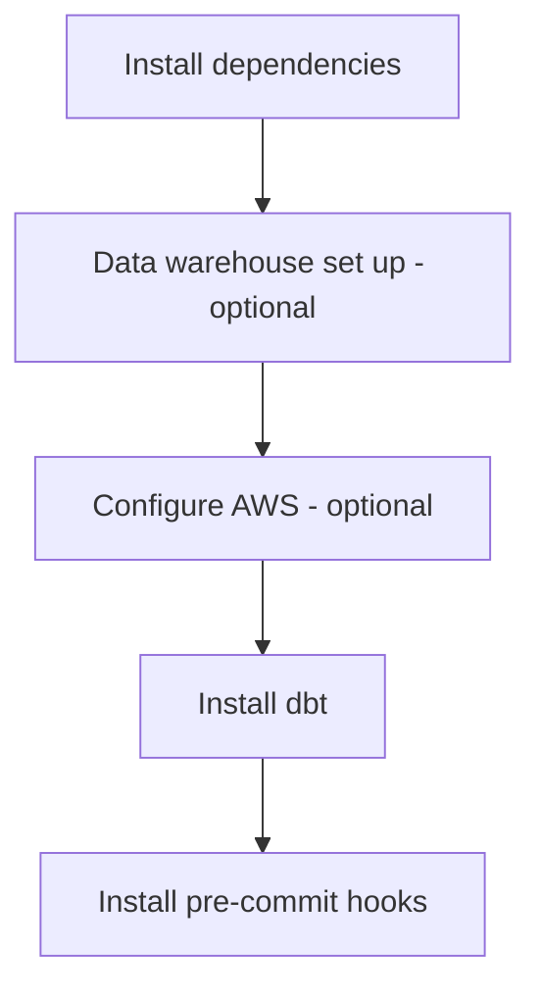

# Local repository setup

Working with dbt Core will involve more than just its installation. We have included additional instructions for individual contributors to set up their local repository to work well with dbt, their data warehouse, and a git-based version control workflow with checks that can be run on the code before opening a PR.

Here's a diagram of the steps you can expect to take:



## 1. Install dependencies

Much of the software in this project is written in Python.
It is usually a good idea to install Python packages into a virtual environment,
which allows them to be isolated from those in other projects which might have different version constraints.

### 1. Install `uv`

We use `uv` to manage our Python virtual environments.
If you have not yet installed it on your system,
you can follow the instructions for it [here](https://docs.astral.sh/uv/getting-started/installation/).
Most of the ODI team uses [Homebrew](https://brew.sh) to install the package.
We do not recommend installing `uv` using `pip`: as a tool for managing Python environments,
it makes sense for it to live outside of a particular Python distribution.

### 2. Install Python dependencies

If you prefix your commands with `uv run` (e.g. `uv run dbt build`),
then `uv` will automatically make sure that the appropriate dependencies are installed before invoking the command.

However, if you want to explicitly ensure that all of the dependencies are installed in the virtual environment,
run
```bash
uv sync
```
in the root of the repository.

Once the dependencies are installed, you can also "activate" the virtual environment
(similar to how conda virtual environments are activated)
by running
```bash
source .venv/bin/activate
```
from the repository root.
With the environment activated, you no longer have to prefix commands with `uv run`.

Which approach to take is largely a matter of personal preference:

- Using the `uv run` prefix is more reliable, as dependencies are *always* resolved before executing.
- Using `source .venv/bin/activate` involves less typing.

### 3. Install go dependencies (optional)

This step is optional, you only need to do it if you intend to work with [Terraform](https://www.terraform.io/). ODI uses Terraform to manage infrastructure. Dependencies for Terraform (mostly in the [go ecosystem](https://go.dev/))
can be installed via a number of different package managers.

If you are running Mac OS, you can install these dependencies with [Homebrew](https://brew.sh/).

If you are running Windows, you can install these dependencies with [Chocolatey](https://chocolatey.org/).

Install the go dependencies (Mac OS):

```bash
brew install terraform terraform-docs tflint go
```

Validate the install with:

```bash
terraform -v

go version
```

## 2. Data warehouse set up (optional)

### 1. Configure Snowflake

In order to use Snowflake (as well as the terraform validators for the Snowflake configuration)
you should set some default local environment variables in your environment.
This will depend on your operating system and shell.

For Windows systems, you can set persistent environment variables by navigating to
Control Panel -> System -> Advanced system settings -> Environmental variables.
There, you can add the variables and values as outlined in the bash instructions below.

For Linux and Mac OS systems,
as well as users of Windows subsystem for Linux (WSL) environment variables are often set in
`~/.zshrc`, `~/.bashrc`, or `~/.bash_profile`.

If you use zsh or bash, open your shell configuration file, and add the following lines:

#### Transformer role (default)

```bash
export SNOWFLAKE_ACCOUNT=<org_name>-<account_name> # format is organization-account
export SNOWFLAKE_DATABASE=TRANSFORM_DEV
export SNOWFLAKE_USER=<your-username>
export SNOWFLAKE_PASSWORD=<your-password>
export SNOWFLAKE_ROLE=TRANSFORMER_DEV
export SNOWFLAKE_WAREHOUSE=TRANSFORMING_XS_DEV
export SNOWFLAKE_AUTHENTICATOR=EXTERNALBROWSER or USERNAME_PASSWORD_MFA
```

Open a new terminal and verify that the environment variables are set.

#### Loader role

```bash
export SNOWFLAKE_ACCOUNT=<org_name>-<account_name> # format is organization-account
export SNOWFLAKE_DATABASE=RAW_DEV
export SNOWFLAKE_USER=<your-username>
export SNOWFLAKE_PASSWORD=<your-password>
export SNOWFLAKE_ROLE=LOADER_DEV
export SNOWFLAKE_WAREHOUSE=LOADING_XS_DEV
export SNOWFLAKE_AUTHENTICATOR=EXTERNALBROWSER or USERNAME_PASSWORD_MFA
```

This will enable you develop scripts for loading raw data into the development environment.
Again, open a new terminal and verify that the environment variables are set.

## 3. Configure AWS (optional)

In order to create and manage AWS resources programmatically,
you need to create access keys and configure your local setup to use them:

1. [Install](https://docs.aws.amazon.com/cli/latest/userguide/getting-started-install.html) the AWS command-line interface.
1. Go to the AWS IAM console and [create an access key for yourself](https://docs.aws.amazon.com/IAM/latest/UserGuide/id_credentials_access-keys.html#Using_CreateAccessKey).
1. In a terminal, enter `aws configure`, and add the access key ID and secret access key when prompted. We use `us-west-2` as our default region.

## 4. Configure dbt

The connection information for your data warehouses will, in general, live outside of this repository.
This is because connection information is both user-specific and usually sensitive,
so it should not be checked into version control.

In order to run this project locally, you will need to provide this information
in a YAML file. Run the following command to create the necessary folder and file.

```bash
mkdir ~/.dbt && touch ~/.dbt/profiles.yml
```

Instructions for writing a `profiles.yml` are documented
[here](https://docs.getdbt.com/docs/get-started/connection-profiles),
there are specific instructions for Snowflake
[here](https://docs.getdbt.com/reference/warehouse-setups/snowflake-setup), and you can find an example below as well.

A minimal version of a `profiles.yml` for dbt development is:

```yml
<profile-name>:
  target: dev
  outputs:
    dev:
      type: snowflake
      account: <account-locator>
      user: <your-username>
      password: <your-password>
      authenticator: externalbrowser or username_password_mfa
      role: TRANSFORMER_DEV
      database: TRANSFORM_DEV
      warehouse: TRANSFORMING_XS_DEV
      schema: DBT_<first-name-inital-lastname>   # e.g. DBT_JDOE
      threads: 4
```

!!! note
    The target name (`dev`) in the above example can be anything.
    However, we treat targets named `prd` differently in generating
    custom dbt schema names (see [here](../data-transformation/dbt.md#custom-schema-names)).
    We recommend naming your local development target `dev`, and only
    include a `prd` target in your profiles under rare circumstances.

You can include profiles for several databases in the same `profiles.yml`,
(as well as targets for production), allowing you to develop in several projects
using the same computer.

You can verify that your `profiles.yml` is configured properly by running the following command in the project root directory (`transform`).

```bash
uv run dbt debug
```

### VS Code setup (optional)

Many people prefer to use featureful editors when doing local development so we included an example set up with VS Code. By equipping a text editor like VS Code with an appropriate set of extensions and configurations
we can largely replicate the dbt Cloud experience locally.
Below is one possible configuration for VS Code.

Install some useful extensions (this list is advisory, and non-exhaustive):

1. dbt's official VS Code extension
    1. Follow [dbt's docs](https://docs.getdbt.com/docs/install-dbt-extension) for instructions on installation.
    1. Test that the dbt VS Code extension extension is working by opening one of the project model `.sql` files and building or running the model.
1. Python (Microsoft's bundle of Python linters and formatters)
    1. Configure the VS Code Python extension to use your virtual environment by choosing `Python: Select Interpreter` from the command palette and selecting your current virtual environment from the options.
1. sqlfluff (SQL linter)

## 5. Install `pre-commit` hooks

This project uses [pre-commit](https://pre-commit.com/) to lint, format,
and generally enforce code quality. These checks are run on every commit,
as well as in CI.

To set up your pre-commit environment locally run the following in the repository root folder:

```bash
pre-commit install
```

The next time you make a commit, the pre-commit hooks will run on the contents of your commit
(the first time may be a bit slow as there is some additional setup).

You can verify that the pre-commit hooks are working properly by running the following snippet to test every file in the repository against the checks.

```bash
pre-commit run --all-files
```

## Updating package versions

It's good for project hygiene to periodically update package versions of the project dependencies.
This brings in security patches, bugfixes, performance enhancements, and new features.
If a project dependency has a [CVE](https://en.wikipedia.org/wiki/Common_Vulnerabilities_and_Exposures) published,
then we recommend updating it as soon as possible, otherwise a more relaxed update cadence is okay
(e.g., once every six months to a year).

When you do update, follow these steps:

1. Check your Python version in `.python-version`. If that version has reached (or is near)
    [end-of-life](https://devguide.python.org/versions/), upgrade to a more recent version.
1. Check the versions of the packages `dependencies` and the `dev` dependency group against
    their most recent major version in [PyPI](https://pypi.org/), and update as appropriate.
    (Note that the [`~` operator](https://peps.python.org/pep-0440/#version-specifiers)
    can be helpful in allowing some wiggle room in versions).
1. Run `uv lock` to update the `uv.lock` file, and commit it.
