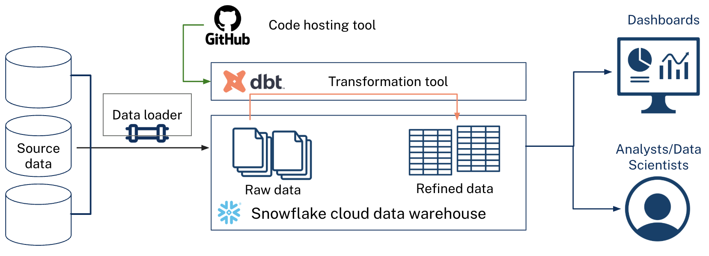

## Modern data stacks

Modern data stacks refer to modular, cloud-native tools that enable the collection, loading, storage, transformation, analysis, and governance of data. These plug-and-play solutions are designed to efficiently handle data pipeline automation and infrastructure costs. Legacy data systems often rely on platforms that house all of these components in one place along with on-prem infrastructure. Traditional systems like these still have their benefits, yet they often are costly and inflexible.

## Analytics engineering

Analytics engineering bridges the gap between data engineering and data analysis. Analytics engineers apply software engineering best practices to the analytics workflow, focusing on transforming raw data into clean, well-documented, and reliable datasets that analysts and stakeholders can trust. They work primarily in SQL and with transformation tools – like dbt, Coalesce, SQLMesh, or others – to build modular data models, write tests, create documentation, and establish data quality standards.

These software engineering best practices – like version control, code review, automated testing, environment separation, and more – reduce errors, make data pipelines more maintainable, and enable teams to collaborate effectively on shared data infrastructure. By treating analytics code like software, organizations can scale their data work confidently and reduce the time spent debugging, explaining data inconsistencies across dashboard , or trying to remember how they previously calculated a field.

Here's a table to illustrate the benefits of analytics engineering:

| Aspect | Without Analytics Engineers | With Analytics Engineers |
|--------|------------------------------|---------------------------|
| **Code management** | SQL scripts in stored procedures, shared drives, email attachments, or local copies | SQL scripts version controlled in Git with full change history|
| **Quality assurance** | Manual spot checks, errors often found by end users | Standardized automated testing frameworks (data quality tests as code) |
| **Collaboration** | Copies of files or even dashboards, hard to know who changed what | Code review process, clear ownership and approval, multiple people can work on the same thing at once |
| **Documentation** | Tribal knowledge, scattered notes, outdated wikis | Documentation lives with code, more likely to stay up to date, tests can alert users when table schemas don't match documentation |
| **Code reuse** | Logic often duplicated across scripts or data products | Emphasis on modular, reusable components (DRY principle) |
| **Debugging** | Dependencies between data assets not always clear | Clear lineage graphs show data flow, standardized error reporting |
| **Onboarding** | Weeks of knowledge transfer, undocumented assumptions | Self-service documentation and clear code structure |

## Training platforms

The tools we will be learning in this self-paced training are as follows:

- Snowflake
- dbt
- GitHub

As you now know, modularity is a big benefit to modern data stacks. Other tools could be used like Databricks for Snowflake, or GitLab for GitHub, etc. The training only uses these three at present.

### Snowflake

Snowflake is a cloud data warehouse that can automatically scale up/down compute resources. It decouples storage and compute resources making it more easy, efficient, and cost-effective to scale your warehouse to your needs; it's cloud-agnostic so you can use it with AWS, Azure, etc.; and it has a clean user interface along with well maintained documentation. Data Custodians work to load raw source data into the warehouse. Data Engineers build and maintain data pipelines via scripts or other tooling.

### dbt

dbt is a SQL-first transformation tool that lets teams quickly and collaboratively deploy analytics code while following software engineering best practices. It works well with version control; encourages modular, reusable SQL code; makes it easy to track lineage of data as it flows through your data warehouse; and it has a large user base. Analytics Engineers or Data Analysts can write SQL code to clean and transform their data to get it analysis-ready. Data Stewards can write data documentation and work with Analytics Engineers or Data Analysts to ensure the data is built to meet program needs. This allows your data team to safely develop and contribute to production-grade data pipelines.

!!! Note
    The same person can hold multiple roles at once.

### GitHub

Github is a code hosting platform for version control and collaboration. GitHub integrates well with local git development and dbt workflows; and provides an intuitive user interface for code review, issue tracking, project boards, and CI/CD. Project managers can use GitHub Project Boards to manage and plan out work though we won't cover this in this training. Other staff can use GitHub to submit pull requests to the main project repository, review code, and track their tasks.

## How these tools work together

These three tools form an integrated workflow for modern analytics engineering:

**The workflow:**

1. **GitHub** stores your dbt project code (SQL models, tests, documentation) with full version history
1. **GitHub Actions** (CI/CD) automatically runs tests and dbt builds on PRs and deploying approved changes to production

1. **dbt** reads your SQL transformation logic, compiles it (resolving refs, macros, Jinja), and sends the compiled SQL to Snowflake

1. **Snowflake** executes the SQL and stores both raw source data and the transformed tables/views
