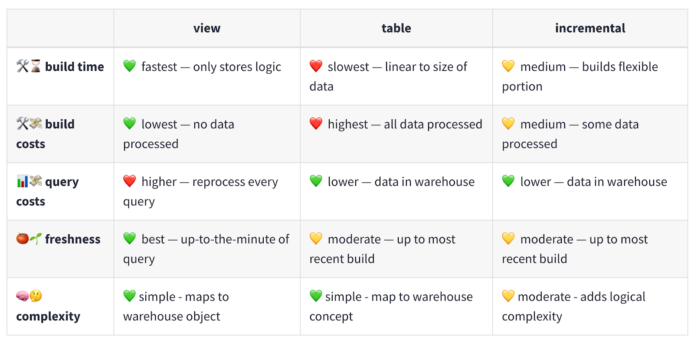

# dbt (data build tool)

## **Day 1**

### What is dbt?

dbt is a SQL-first transformation tool that lets teams quickly and collaboratively deploy analytics code while following software engineering best practices like modularity, version control, CI/CD, and documentation. This allows your data team to safely develop and contribute to production-grade data pipelines.

### Data modeling in the context of dbt

In the context of dbt, data modeling refers to the process of organizing data in a structured and efficient manner to facilitate data analysis and decision-making. Data models in dbt serve as blueprints for transforming and organizing your raw data into valuable insights. Data models in their final form are usually a representation of a business or program area and live as tables or views in your data warehouse.

### Data layers (staging, intermediate, marts)

Data layers represent a systematic approach to data modeling by organizing data into distinct phases. dbt does a particularly great job of explaining best practices to structuring your project and data with naming conventions, example code, and reasoning on such practices in [this guide](https://docs.getdbt.com/best-practices/how-we-structure/1-guide-overview). We’ve summarized it below, but still recommend a thorough read of dbt’s guide.

1. **Staging**
    1. The staging layer is the initial point of contact for your raw data
    1. Models in the staging layer have a one-to-one relationship with source data ensuring data integrity and providing a reliable foundation for downstream models
    1. There are very few transformations that happen in this layer. Appropriate ones are:
        1. Column renaming (e.g. PLACEFP to place_fips)
        1. Data type casting (e.g. string type to numeric)
        1. Basic computations (e.g. cents to dollars)
    1. Staging models are often materialized ephemerally or as views (more about materializations later!)
    1. Files are prefixed with `stg_` and saved in a subdirectory usually named “staging” of the models folder
1. **Intermediate**
    1. Intermediate models are where you start applying more complex transformations to your data
    1. This layer is used for data cleansing, feature engineering, and combining data from different sources
    1. Intermediate models allow you to build modular and reusable transformations following the principles of [DRY (Don’t Repeat Yourself)](https://docs.getdbt.com/terms/dry#why-write-dry-code)
    1. Common transformations that happen in this layer are:
        1. Table joins or unions
        1. Data aggregations (e.g. using a function like `SUM()`)
        1. Data pivots
    1. Files are prefixed with `int_` and saved in a subdirectory usually named “intermediate” of the models folder
1. **Marts (or Data Marts)**
    1. Marts are the final layer in the data modeling process, representing consumable datasets tailored for specific business or programs needs
    1. Sometimes called the entity layer or concept layer, to emphasize that our marts are meant to represent a specific entity or concept at its unique grain
    1. Use plain English to name the file based on the concept that forms the grain of the mart e.g. `incidents.sql`, `claimants.sql`, `orders.sql`
    1. Wide and denormalized
    1. Files are saved in a subdirectory usually named "marts" of the models folder

### Common table expressions (CTEs)

CTEs are widely used as a way to create modular and readable SQL queries. You can think of CTEs as temporary, named data tables within your SQL queries. CTEs facilitate modularity and readability by encapsulating complex subqueries and making them reusable throughout your data models.

Often CTEs are framed as an alternative to SQL subqueries. In dbt-style SQL, CTEs are usually preferable to subqueries for a few reasons:

1. They allow you to read code from top to bottom rather than inside out
1. They allow for better reuse of intermediate results
1. They allow you to give descriptive names to intermediate results

<table>
  <thead>
    <tr>
      <th>Subquery</th>
      <th>CTE</th>
    </tr>
  </thead>
  <tbody>
    <tr>
      <td>
        <pre>
          <code>
select *
from (
    select
        COUNTY_NAME,
        SUM(SAMPLE_COUNT) as total_samples
    from raw_dev.water_quality.stations
    group by "COUNTY_NAME"
) as subquery
where total_samples > 10
          </code>
        </pre>
      </td>
      <td>
        <pre>
          <code>
with total_samples_by_county as (
    select
        "COUNTY_NAME",
        SUM(SAMPLE_COUNT) as total_samples
    from raw_dev.water_quality.stations
    group by "COUNTY_NAME"
)
select * from total_samples_by_county
where total_samples > 10
          </code>
        </pre>
      </td>
    </tr>
  </tbody>
</table>

### Tour of dbt Cloud user interface

1. We’ll give you a brief overview of the dbt Cloud user interface:
    1. _File browser_
    1. _File editor_
    1. _Preview pane_
1. Validate your development environment:
    1. Open the Develop tab in your own environment and open `transform/models/staging/training/stg_water_quality__stations.sql`
    1. Click on the _Preview_ button. You should see data in the lower panel
1. Demonstrate the _Lint_/_Fix_ functionality
1. Demonstrate the _Build_/_Run_ functionality
1. Verify that the models you built/ran are visible in your personal schema within `TRANSFORM_DEV`

### **Exercises**

Click either link for [<u>dbt Cloud</u>](https://cagov.github.io/caldata-mdsa-training/data-transformation/dbt-cloud-exercises/#day-1) or [<u>dbt Core</u>](https://cagov.github.io/caldata-mdsa-training/data-transformation/dbt-cloud-exercises/#day-1) exercises.

### Day 1: References

#### dbt Fundamentals

[dbt Fundamentals](https://courses.getdbt.com/courses/fundamentals) is an online self-paced course on how to use dbt and dbt Cloud. It is broadly similar to the content in this training, and you may find some of the videos from the course helpful to review. We’ve linked to some of the videos below.

#### Models in dbt

- [What are models?](https://platform.thinkific.com/videoproxy/v1/play/c71iuqg02svskgqkn6jg)
- [Building your first model](https://platform.thinkific.com/videoproxy/v1/play/cecuppiekd0onghk4p20)
- [What is modularity?](https://platform.thinkific.com/videoproxy/v1/play/c71iuqg02svskgqkn6lg)

## **Day 2**

### What are all these YAML files?!

Broadly speaking, there are two kinds of relations (a relation is a table or view) in a dbt project: “models” and “sources”. “Sources” are your raw, untransformed data sets. “Models” are the tables and views that you create when transforming your data into something. Both of these are described using YAML files.

The YAML files in a dbt project contain the metadata for your relations, both sources and models. They include:

- Documentation
- Configuration
- Data tests

### Wait, but what _is_ YAML?

YAML stands for “Yet Another Markup Language”. It is a superset of JSON (JavaScript Object Notation) and intended to be a more human readable version, but JSON is still perfectly valid! For example, `{“my-key”: 4}` is YAML. YAML has support for:

- Key-value pairs (i.e., dictionaries/maps)
- Lists
- Strings, numbers, booleans

It is also absolutely ubiquitous for tool configuration. Tools that are configured using YAML include:

- dbt
- GitHub Actions
- Azure Pipelines
- Kubernetes
- AWS CloudFormation
- Many more!

Indentation is meaningful in YAML. Make sure that you use **2 spaces**, rather than tab characters, to indent sections per level of nesting.

#### YAML dictionaries/maps

```yaml
# In YAML, comments are started with the hashtag # symbol

# Dictionaries/maps are constructed using indentation and the colon ":" symbol
my_dictionary:
  a_number: 12
  a_string: "hello, world!"
  a_boolean: true
  a_nested_dictionary:
    key: "value"
    another_key: "another value"

# Because YAML is a superset of JSON, we can equivalently write:
my_dictionary: {"a_number":12, "a_string": "hello, world!", "a_boolean": true}
```

#### YAML lists

```yaml
# Lists are constructed using the dash - symbol
my_list:
  - 1
  - 2
  - 3
  - 4

# Because YAML is a superset of JSON, we can equivalently write:
my_list: [1, 2, 3, 4]
```

#### YAML strings

```yaml
# YAML strings may be written without quotes "" as long as there is no ambiguity
my_ionary:
  a_string: "britt is cool!"
  also_a_string: britt is cool

# But omitting the quotes for a string can get you in trouble when the string is ambiguous!
my_dictionary:
  # This is interpreted as a number (which is not what we want)
  python_version: 3.9

  # This would pull in python 3.1 instead of 3.10!
  another_python_version: 3.10

  # This gets interpreted as a boolean instead of a string!
  should_i_eat_lunch: yes
```

#### YAML multiline strings

```yaml
# Use the pipe | or right angle bracket > symbol to break up long strings for legibility
long_snippet: |
  cotton candy blues
  juxtaposed with blushing peaks
  postcard-worthy views

another_long_snippet: >
  Call me Ishmael. Some years ago - never mind how long precisely -
  having little or no money in my purse, and nothing particular to
  interest me on shore, I thought I would sail about a little and see
  the watery part of the world.
```

#### Markdown in YAML

```yaml
# dbt renders description strings as Markdown
a_markdown_string: |
  This is rendered as Markdown! So I can use _emphasis_
  or **bold text**. I can also include:

  - Lists
  - of
  - items

  as well as [URLs](https://github.github.com/gfm/)
```

!!! note
    You can't actually render markdown within a code block. Code blocks are designed to
    display text literally, so Markdown formatting like bolding, italicizing, or headings
    won't be applied, hence why you do not see the affect above. However, in dbt which allows
    for richer text formatting, applying markdown to your YAML like we've done above will work.

### Sources and refs

Let’s take a look at the `source` and `ref` dbt macros. Instead of directly referring to the database, schema, table, and view names, we use the `source` and `ref` dbt macros. The syntax for this is to replace the raw names with a template directive like this: `{{ source('WATER_QUALITY', 'stations') }}`.

The curly braces are a syntax for _Jinja_ templating. The expression within the curly braces is a Python (ish) function which gets evaluated and inserted into the SQL file. There are lots of things we can do with Jinja to help generate our SQL queries, including basic math, custom Python functions, loops, and if-else statements. Most of the time, you will just need to be able to use the `source` and `ref` macros.

#### source()

This function creates dependencies between source data and the current model (usually staging) referencing it. Your dbt project will depend on raw data stored in your database. Since this data is normally loaded by other tools than dbt, the structure of it can change over time – tables and columns may be added, removed, or renamed. When this happens, it is easier to update models if raw data is only referenced in one place.

**Example:** replace `RAW_DEV.WATER_QUALITY.LAB_RESULTS` with `{{ source('WATER_QUALITY', 'lab_results') }}`.

#### ref()

This function is how you reference a model from another: it allows you to build more complex models by referring to other ones and constructing a data lineage graph. Under the hood this function is actually doing two important things. First, it is interpolating the schema into your model file to allow you to change your deployment schema via configuration. Second, it is using these references between models to automatically build the dependency graph. This will enable dbt to deploy models in the correct order when using dbt run.

**Example:** Replace `stg_water_quality__stations` with `{{ ref(‘stg_water_quality__stations’) }}`.

#### Why shouldn’t we directly refer to the table names?

It can be initially confusing to people that we don’t directly refer to the names of the other data models, and instead do it indirectly via the `source` and `ref` macros. There are a few reasons for this:

1. By explicitly linking your sources and models using the `source` and `ref` macros, you help dbt in constructing a data lineage graph (i.e., which tables depend on which others). This allows you to do things like “rebuild a model and all of its upstream dependencies”, or “test a model and all of its downstream dependents”.
1. It becomes easier to rename a data source. This can be especially useful if the data source comes to you with unhelpful names.
1. Source and refs become context aware. For example, in a development context, your personal development schema is templated into the SQL queries, but in a production context the final production schema is templated in. This allows for safer development of new models.

### Data testing

1. We’ll talk through how to write generic tests for things like “not null” and “unique”.
1. For people who are familiar with transactional databases, we can also talk about why tests like this are ever needed (i.e., why don’t we handle it using constraints?)
    1. In a traditional transactional database like postgres or SQL Server, you can have a uniqueness constraint on a column. Snowflake does not respect uniqueness constraints and most OLAP databases do not. Primary keys and foreign keys are examples of unique columns that are respected in OLTP databases that are not in OLAP databases.
    1. [More reading](https://cagov.github.io/data-infrastructure/learning/cloud-data-warehouses/#primary-keys-and-constraints) on this topic

### **Exercises**

Click either link for [<u>dbt Cloud</u>](https://cagov.github.io/caldata-mdsa-training/data-transformation/dbt-cloud-exercises/#day-2) or [<u>dbt Core</u>](https://cagov.github.io/caldata-mdsa-training/data-transformation/dbt-cloud-exercises/#day-2) exercises.

### Day 2: References

#### Sources

- [Modularity and ref functions](https://platform.thinkific.com/videoproxy/v1/play/cefo4lqgv9ite187s6pg)
- [What are sources?](https://platform.thinkific.com/videoproxy/v1/play/c6mfkh840bhpn3t0c730)
- [Configure and select from sources](https://platform.thinkific.com/videoproxy/v1/play/ce4cj9s69iu53jbdif6g)
- [Documenting sources](https://platform.thinkific.com/videoproxy/v1/play/ce2dbtnf17fhkgqdq580)

#### Testing

- [What is testing?](https://platform.thinkific.com/videoproxy/v1/play/c71iuqg40bhpn3t11pcg)
- [Generic tests](https://platform.thinkific.com/videoproxy/v1/play/ce9kjv0r715nknv53nhg)

## **Day 3**

Let refresh our memory on [data layers for intermediate models](https://cagov.github.io/caldata-mdsa-training/data-transformation/dbt/#data-layers-staging-intermediate-marts). Let's also revisit [common table expressions (CTEs)](https://cagov.github.io/caldata-mdsa-training/data-transformation/dbt/#common-table-expressions-ctes)

### CTE examples

``` sql
-- Let's go from writing our code like this...

select
    "station_id",
    "latitude",
    "longitude",
    "county_name"

from {{ source('WATER_QUALITY', 'lab_results') }}

-- To writing our code like this

with source as (
    select * from {{ source('WATER_QUALITY', 'lab_results') }}
),

lab_results as (
  select
    "station_id",
    "latitude",
    "longitude",
    "county_name"

  from source
)

select * from lab_results
```

Here’s [another example of a more complex, multi-stage CTE](https://github.com/cagov/data-infrastructure/blob/main/transform/models/marts/geo_reference/geo_reference__global_ml_building_footprints_with_tiger.sql) query.

### Materializations

Materializations refer to the way dbt executes and persists the results of SQL queries. It is the Data Definition Language (DDL) and Data Manipulation Language (DML) used to create a model’s equivalent in a data warehouse.

Understanding the options for materializations will allow you to choose the best strategy based on factors like query performance, data freshness, and data volume. There are four materializations used in dbt: view, table, incremental, and ephemeral. We used [dbt as our main source](https://docs.getdbt.com/best-practices/materializations/5-best-practices) for most of the materialization descriptions below.

#### View

- 🔍 Views return the freshest, real-time state of their input data when they’re queried, this makes them ideal as building blocks for larger models.
- 🤏 Views are also great for small datasets with minimally intensive logic that we want near real time access to.
- 🙅‍♀️ Staging models are rarely accessed directly by our end users.
- 🧱 Staging models need to be always up-to-date and in sync with our source data as building blocks for later models so we’ll want to materialize our staging models as views.
- 👍 Since views are the default materialization in dbt, we don’t have to do any specific configuration for this.
- 💎 Still, for clarity, it’s a good idea to go ahead and specify the configuration to be explicit. We’ll want to make sure our dbt_project.yml looks like this:

```yaml
models:
  jaffle_shop:
    staging:
      +materialized: view
```

#### Table

- 🛠️ Tables are the most performant materialization, they return transformed data when queried with no need for reprocessing.
- 💪 Tables are also ideal for frequently used, compute intensive transformations. Making a table allows us to _freeze_ transformations in place.
- 📊 Marts, like one that services a popular dashboard, are frequently accessed directly by our end users, and need to be performant.
- ⌛ Can often function with intermittently refreshed data, end user decision making in many domains is fine with hourly or daily data.
- 🛠️ Given the above properties we’ve got a great use case for building the data itself into the warehouse, not the logic. In other words, a table.
- ❓ The only decision we need to make with our marts is whether we can process the whole table at once or do we need to do it in chunks, that is, are we going to use the table materialization or incremental.

#### Incremental

- 🧱 Incremental models build a table in pieces over time, only adding and updating new or changed rows.
- 🏎️ Builds more quickly than a regular table of the same logic.
- 🐢 Initial runs are slow. Typically we use incremental models on very large datasets, so building the initial table on the full dataset is time consuming and equivalent to the table materialization.

Sources: [Incremental models in-depth](https://docs.getdbt.com/best-practices/materializations/4-incremental-models) and [Available materializations](https://docs.getdbt.com/best-practices/materializations/2-available-materializations)

#### A comparison table



Source: [Available materializations](https://docs.getdbt.com/best-practices/materializations/2-available-materializations)

#### Materializations golden rule

- 🔍 Start with a view. When the view gets too long to query for end users,
- ⚒️ Make it a table. When the table gets too long to build in your dbt Jobs,
- 📚 Build it incrementally. That is, layer the data in chunks as it comes in.

#### Ephemeral

Ephemeral models are not directly built into the database. Instead, dbt will interpolate the code from this model into dependent models as a CTE. Use the ephemeral materialization for:

- Light-weight transformations that are early on in your DAG
- When they are only used in one or two downstream models, and
- Do not need to be queried directly

✅ Can help keep your data warehouse clean by reducing clutter<br/>
🚫 Overuse of ephemeral materialization can make queries harder to debug

Source: [Materializations](https://docs.getdbt.com/docs/build/materializations#ephemeral)

**Where to configure materializations**
You can configure models in `dbt_project.yml`, the YAML file within the corresponding model’s folder, or within a specific model itself. Confusing thing about dbt configuration: the syntax and format change depend on where you use it!

```yaml
# in the dbt_project.yml file...
models:
  dse_analytics:
    staging:
      +materialized: view
    intermediate:
      +materialized: view
    marts:
      +materialized: table

# the YAML file within the corresponding model’s folder
version: 2

models:
  - name: int_state_entities__active
    materialized: table
    description: This is a sample description.
    columns:
      - name: name
        description: Name of the entity
```

```sql
-- within a specific model itself
{{
    config(
        materialized='view'
    )
}}

select ...
```

### **Exercises**

Click either link for [<u>dbt Cloud</u>](https://cagov.github.io/caldata-mdsa-training/data-transformation/dbt-cloud-exercises/#day-3) or [<u>dbt Core</u>](https://cagov.github.io/caldata-mdsa-training/data-transformation/dbt-cloud-exercises/#day-3) exercises.

### Additional learning

#### Macros

[Macros](https://docs.getdbt.com/docs/build/jinja-macros#macros) in [Jinja](https://docs.getdbt.com/docs/build/jinja-macros) are pieces of code that can be reused multiple times – they are analogous to "functions" in other programming languages, and are extremely useful if you find yourself repeating code across multiple models. Remember (DRY). Macros are defined in .sql files, typically in your macros directory (e.g.`transform/macros`).

Take a look at our macro example on the `stations` data.

1. Switch to the `britt-dbt-training` branch
1. Open and review `transform/macros/map_county_name_to_county_fips.sql`
    1. Then open `transform/models/intermediate/training/int_water_quality__counties.sql` and review line 9
1. Another [macro example](https://github.com/cagov/data-infrastructure/blob/main/transform/macros/map_class_fp.sql) that is called by [this code](https://github.com/cagov/data-infrastructure/blob/65a4a5c47f0326d50161bc4a1a3e81c20cb19a3e/transform/models/marts/geo_reference/geo_reference__global_ml_building_footprints_with_tiger.sql#L34)

#### dbt_utils package

The [dbt_utils package](https://hub.getdbt.com/dbt-labs/dbt_utils/latest/) contains macros that can be (re)used across this project. Software engineers frequently modularize code into libraries. These libraries help programmers operate with leverage. In dbt, libraries like these are called packages. dbt's packages are powerful because they tackle many common analytic problems that are shared across teams.

1. Example that uses the _dbt_utils_ test [_equal_rowcount_](https://github.com/dbt-labs/dbt-utils/tree/1.1.1/?tab=readme-ov-file#equal_rowcount-source)
    1. Switch to the `britt-dbt-training` branch
    1. Open `transform/models/staging/training/_water_quality.yml` and review lines 6-10
    1. Run`dbt test --select stg_water_quality__stations`
        1. Note this test fails if trying to compare a table to a view

```yaml
version: 2

models:
  - name: stg_water_quality__stations
    description: Staging model for stations.
    config:
      materialized: table
    tests:
      - dbt_utils.equal_rowcount:
        compare_model: source('WATER_QUALITY', 'stations')
```

#### Custom tests

dbt allows you to [create your own tests](https://docs.getdbt.com/docs/build/data-tests#overview) if you cannot find what you’re looking for in dbt_utils (see above) or in other packages. Data tests are assertions you make about your models and other resources in your dbt project (e.g. sources, seeds and snapshots). When you run `dbt test`, dbt will tell you if each test in your project passes or fails.

There are two ways of defining data tests in dbt:

- A singular data test is testing in its simplest form: If you can write a SQL query that returns failing rows, you can save that query in a .sql file within your [test directory](https://docs.getdbt.com/reference/project-configs/test-paths). It's now a data test, and it will be executed by the dbt test command.
- A generic data test is a parameterized query that accepts arguments. The test query is defined in a special test block (like a [macro](https://docs.getdbt.com/docs/build/jinja-macros)). Once defined, you can reference the generic test by name throughout your .yml files—define it on models, columns, sources, snapshots, and seeds. dbt ships with [four generic data tests built in](https://docs.getdbt.com/reference/resource-properties/data-tests#out-of-the-box-data-tests) (`not_null`, `unique`, `accepted_values`, `relationships`), and we think you should use them!

### Day 3: References

#### Materializations, Jinja, and dbt Models

- [dbt materialization and performance considerations](https://cagov.github.io/data-infrastructure/dbt/dbt-performance/#2-model-level-materialization-matters)
- [Jinja tutorial: Use Jinja to improve your SQL code](https://docs.getdbt.com/guides/using-jinja?step=1)
- [Re-watch the second and third video from Day 1: Models in dbt](https://cagov.github.io/caldata-mdsa-training/data-transformation/dbt-cloud/#models-in-dbt)

## **Day 4**

### dbt Docs

dbt generates HTML documentation from your SQL models and YAML configuration files. This documentation can then be hosted in a number of places, including dbt Cloud, GitHub Pages, or Azure Static Web Apps. We will show you:

1. How to generate docs using dbt Cloud. This can be useful if you are writing docs in a branch and want to visualize how they are rendered.
1. If we are using GitHub, we’ll demonstrate how the docs are built from the repository and hosted on GitHub Pages. If we are using Azure DevOps, we’ll demonstrate how the docs are built from the repository and hosted using Azure Static Web Apps.

### dbt Cloud deployments and jobs

We’ll talk through the concept of an “Environment”, which is a virtual machine in dbt Cloud that has all of the relevant software dependencies and environment variables set. You’ve already encountered one environment, which is your “Develop:  Cloud IDE”. But you can create other environments in dbt Cloud (and in other services) for various purposes. Examples of other environments:

1. A “production” environment which is used to run the dbt models that have been merged to `main`. This can be run on an ad-hoc basis, or can be run on a schedule to ensure that models are never more than some amount of time old.
1. A “continuous integration (CI)" environment, which is used to run tests on branches and pull requests, and can help to catch bugs and regressions before they are deployed to production.
1. A “docs” environment, used for building docs.

We’ll also introduce the concept of a “Job”, which is a command that is run in an environment, and can either be run on a schedule or can be triggered by some event.

### Continuous integration and continuous deployment (CI/CD)

#### What is CI/CD and why you shouldn’t ignore it

CI/CD checks in GitHub or Azure DevOps are automated tests that are run against your code every time you push a change. These checks can help you identify errors and potential issues early in the development process, before they can cause problems in production.

There are a number of different types of CI/CD checks, including:

- **Code quality checks:** These look for issues with your code, such as syntax errors, potential security vulnerabilities, and performance issues.
- **Build checks:** These ensure your code can be successfully built.
- **Test checks:** These run your unit tests and integration tests to ensure that they pass.
- **Deployment checks:** These ensure your code can be successfully deployed to production.

CI/CD checks are an important part of the software development process. They can help you:

- **Catch errors and issues early:** CI/CD checks can identify issues with your code before they can cause problems in production.
- **Improve code quality:** CI/CD checks can help you to improve the quality of your code by identifying issues such as code smells (e.g. duplicate or dead code) and potential security vulnerabilities.

To reiterate, CI/CD checks can help you to improve the quality of your code, reduce the risk of production issues, and save the whole team time in the long run. We have set up your project repository so that these checks cannot be ignored by preventing a merge of a PR with CI/CD failures. However, CI/CD checks shouldn’t be considered a pain or just a thing we have to do, they are rather intended to be a routine and helpful part of the development process.

#### Demo: CI/CD in a development workflow

1. How to read the results of CI checks on a PR in GitHub or Azure DevOps.
1. How merging to `main` results in production dbt builds.

### Custom schema names

1. We’ll talk about how the database schemas in which dbt models are built are determined. In development, the models get built in a different place (e.g., your `DBT_<first-name-initial+last-name>`schema) than they do in production.
1. We’ll discuss how this project is configured to use a custom schema name generated using `transform/macros/get_custom_schema.sql`.

### **Exercises**

Click either link for [<u>dbt Cloud</u>](https://cagov.github.io/caldata-mdsa-training/data-transformation/dbt-cloud-exercises/#day-4) or [<u>dbt Core</u>](https://cagov.github.io/caldata-mdsa-training/data-transformation/dbt-cloud-exercises/#day-4) exercises.

### Day 4: References

#### Documentation

- [What is documentation?](https://platform.thinkific.com/videoproxy/v1/play/c71iuqg40bhpn3t11p80)
- [Writing documentation and doc blocks](https://platform.thinkific.com/videoproxy/v1/play/ce2dchnf17fhkgqdq59g)
- [Creating encrypted key-pairs for service accounts that run CI and Production jobs](https://docs.snowflake.com/en/user-guide/key-pair-auth#configuring-key-pair-authentication)
