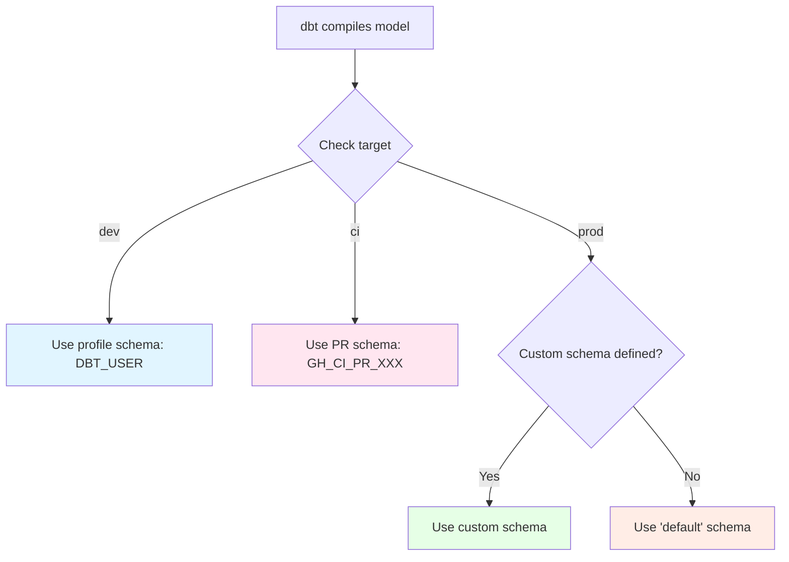

# Schema Naming Strategy

## Overview

Understanding how dbt automatically names schemas in different environments is crucial for working effectively with the modern data stack. This page explains the `get_custom_schema` macro and how it determines where your models land.

---

## The Problem

Without a schema naming strategy, you'd face conflicts:

- Multiple developers overwriting each other's work
- CI builds interfering with dev work
- Production accidentally getting dev data

**Solution:** Context-aware schema naming

---

## The get_custom_schema Macro

dbt uses a macro to determine schema names dynamically:

**Location:** `macros/get_custom_schema.sql` (in your dbt project)

**Simplified logic:**

```sql

    

    
        {{ custom_schema_name | trim }}

    
        {{ 'GH_CI_PR_' ~ env_var('PR_NUMBER', 'unknown') }}

    
        {{ default_schema }}

    

```

---

## Schema Naming by Environment

### Development Environment

**Target:** `dev`
**Profile configuration:**

```yaml
dev:
  schema: DBT_{{ env_var('USER_INITIALS', 'UNKNOWN') }}
```

**Result:** All models in one personal schema

**Example:**
```
Model:  models/staging/stg_stations.sql
Schema: TRANSFORM_DEV.DBT_JDOE.stg_stations
        └── database   └── schema   └── model
```

**Why:** Isolates each developer's work

---

### CI Environment

**Target:** `ci`
**Dynamic schema based on PR number:**

```yaml
ci:
  schema: "{{ env_var('DBT_SCHEMA_PREFIX') }}"
```

**Environment variable:** `GH_CI_PR_123`

**Result:** Each PR gets its own schema

**Example:**
```
PR #123:
  Model:  models/staging/stg_stations.sql
  Schema: TRANSFORM_DEV.GH_CI_PR_123.stg_stations

PR #456:
  Model:  models/staging/stg_stations.sql
  Schema: TRANSFORM_DEV.GH_CI_PR_456.stg_stations
```

**Why:** Multiple PRs can test simultaneously without conflicts

---

### Production Environment

**Target:** `prod`
**Uses custom schema if defined, otherwise default:**

**Without custom schema:**
```sql
-- models/staging/stg_stations.sql (no config)
-- Results in: TRANSFORM_PRD.default.stg_stations
```

**With custom schema:**
```sql
-- models/staging/stg_stations.sql
{{
    config(
        schema='water_quality'
    )
}}
-- Results in: TRANSFORM_PRD.water_quality.stg_stations
```

**Why:** Clean, organized production schemas

---

## Custom Schema Configuration

### In Model File

```sql
-- models/marts/water_quality/dashboard.sql
{{
    config(
        schema='water_quality',
        materialized='table'
    )
}}

SELECT * FROM {{ ref('stg_stations') }}
```

### In YAML

```yaml
# models/marts/water_quality/_water_quality.yml
models:
  - name: dashboard
    config:
      schema: water_quality
      materialized: table
```

### In dbt_project.yml

```yaml
models:
  my_project:
    marts:
      water_quality:
        +schema: water_quality
        +materialized: table
```

---

## Complete Example

### Model Definition

```sql
-- models/marts/water_quality/monitoring_dashboard.sql
{{
    config(
        schema='water_quality',
        materialized='table'
    )
}}

WITH stations AS (
    SELECT * FROM {{ ref('stg_water_quality__stations') }}
),

final AS (
    SELECT
        station_id,
        county_name,
        latitude,
        longitude
    FROM stations
)

SELECT * FROM final
```

### Schema Naming Across Environments

| Environment | Full Table Path |
|-------------|-----------------|
| **Local (Jane)** | `TRANSFORM_DEV.DBT_JDOE.monitoring_dashboard` |
| **Local (Bob)** | `TRANSFORM_DEV.DBT_BSMITH.monitoring_dashboard` |
| **CI (PR #123)** | `TRANSFORM_DEV.GH_CI_PR_123.monitoring_dashboard` |
| **Production** | `ANALYTICS_PRD.water_quality.monitoring_dashboard` |

---

## How Schema is Determined



---

## Environment Variable Reference

### Development

```bash
# Set in your shell or .bashrc
export USER_INITIALS=JDOE
```

### CI (GitHub Actions)

```yaml
env:
  DBT_SCHEMA_PREFIX: GH_CI_PR_${{ github.event.pull_request.number }}
  PR_NUMBER: ${{ github.event.pull_request.number }}
```

### Production

```yaml
# No special variables needed
# Uses custom schema from model config
```

---

## Database vs Schema

### Database Selection

Controlled by `database` in profiles.yml:

```yaml
dev:
  database: TRANSFORM_DEV

prod:
  database: TRANSFORM_PRD
```

### Schema Selection

Controlled by `get_custom_schema` macro logic + target config

**Complete Path:**
```
{{ database }}.{{ schema }}.{{ model_name }}
```

---

## Common Patterns

### Pattern 1: Domain-Based Schemas

Group related marts by domain:

```
ANALYTICS_PRD.water_quality.*
ANALYTICS_PRD.finance.*
ANALYTICS_PRD.operations.*
```

**Configuration:**
```sql
-- models/marts/water_quality/*.sql
{{ config(schema='water_quality') }}

-- models/marts/finance/*.sql
{{ config(schema='finance') }}
```

### Pattern 2: Layer-Based Schemas

Organize by data pipeline layer:

```
TRANSFORM_PRD.staging.*
TRANSFORM_PRD.intermediate.*
ANALYTICS_PRD.marts.*
```

**Configuration:**
```yaml
# dbt_project.yml
models:
  my_project:
    staging:
      +schema: staging
    intermediate:
      +schema: intermediate
    marts:
      +schema: marts
```

### Pattern 3: Mixed Strategy

Staging/intermediate in transform, marts by domain:

```
TRANSFORM_PRD.staging.stg_*
TRANSFORM_PRD.intermediate.int_*
ANALYTICS_PRD.water_quality.monitoring_*
ANALYTICS_PRD.water_quality.county_*
```

---

## Debugging Schema Issues

### Check Compiled SQL

```bash
dbt compile --select model_name

# View compiled SQL
cat target/compiled/project/models/path/model_name.sql
```

Shows actual table names after `{{ ref() }}` resolution

### Check dbt Run Output

```bash
dbt run --select model_name
```

Output shows:
```
CREATE TABLE TRANSFORM_DEV.DBT_JDOE.model_name AS (...)
```

### Query Snowflake

```sql
-- See what schemas exist
SHOW SCHEMAS IN DATABASE TRANSFORM_DEV;

-- See what tables exist in a schema
SHOW TABLES IN SCHEMA TRANSFORM_DEV.DBT_JDOE;
```

---

## Best Practices

### 1. Consistent Naming

Use the same custom schema logic across projects:

```sql
-- Good
schema: 'water_quality'
schema: 'finance'

-- Avoid mixing conventions
schema: 'WaterQuality'  -- Different case
schema: 'wq'  -- Abbreviation
```

### 2. Document Schema Strategy

In your project README:

```markdown
## Schema Organization

- `staging`: Raw data transformations
- `intermediate`: Business logic
- Domain-specific marts:
  - `water_quality`: Water monitoring data
  - `finance`: Financial reports
```

### 3. Don't Hardcode Schemas

```sql
-- Bad - hardcoded schema
SELECT * FROM TRANSFORM_DEV.DBT_JDOE.stg_stations

-- Good - use ref()
SELECT * FROM {{ ref('stg_stations') }}
```

### 4. Test Schema Changes

Before changing schema strategy:

1. Test in dev environment
2. Verify compiled SQL
3. Check lineage graph
4. Coordinate with team

---

## Troubleshooting

### Models Landing in Wrong Schema

**Check:**
1. Target name: `SELECT CURRENT_DATABASE(), CURRENT_SCHEMA();`
2. Profile configuration in `~/.dbt/profiles.yml`
3. Custom schema config in model/YAML/project

**Common cause:** Forgetting to specify target:
```bash
dbt run  # Uses default target (usually 'dev')
dbt run --target prod  # Uses prod target
```

### "Schema already exists" Error

**In CI:** Previous CI run didn't clean up

**Solution:**
```sql
-- Manually drop old CI schemas
DROP SCHEMA IF EXISTS TRANSFORM_DEV.GH_CI_PR_123;
```

Or add cleanup step to CI workflow

---

## See Also

- [Local to Production Walkthrough](local-to-production.md) - See schemas change across stages
- [End-to-End Workflow](end-to-end-workflow.md) - Architecture overview
- [End-to-End Workflow](end-to-end-workflow.md) - Complete pipeline context
- [dbt Docs: Custom Schemas](https://docs.getdbt.com/docs/build/custom-schemas)
