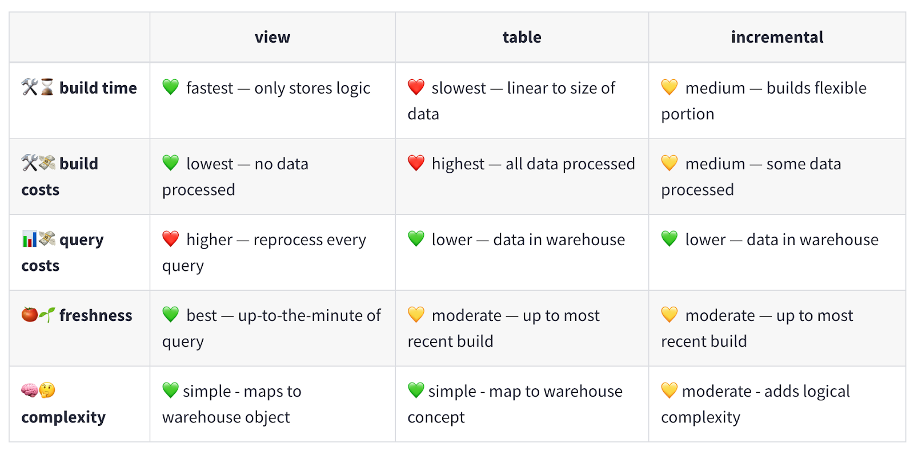

# dbt (data build tool)

## Part III: Materializations and intermediate models

### Materializations

Materializations refer to the way dbt executes and persists the results of SQL queries. It is the Data Definition Language (DDL) and Data Manipulation Language (DML) used to create a model’s equivalent in a data warehouse.

Understanding the options for materializations will allow you to choose the best strategy based on factors like query performance, data freshness, and data volume. There are four materializations used in dbt: view, table, incremental, and ephemeral. We used [dbt docs as our main source](https://docs.getdbt.com/best-practices/materializations/5-best-practices) for most of the materialization descriptions below.

#### View

- Views return the freshest, real-time state of their input data when they’re queried, this makes them ideal as building blocks for larger models.
- Views are also great for small datasets with minimally intensive logic that we want near real time access to.
- Staging models are rarely accessed directly by our end users.
- Staging models need to be always up-to-date and in sync with our source data as building blocks for later models so we’ll want to materialize our staging models as views.
- Since views are the default materialization in dbt, we don’t have to do any specific configuration for this.
- Still, for clarity, it’s a good idea to go ahead and specify the configuration to be explicit. We’ll want to make sure our dbt_project.yml looks like this:

```yaml
models:
  jaffle_shop:
    staging:
      +materialized: view
```

#### Table

- Tables are the most performant materialization, they return transformed data when queried with no need for reprocessing.
- Tables are also ideal for frequently used, compute intensive transformations. Making a table allows us to _freeze_ transformations in place.
- Marts, like one that services a popular dashboard, are frequently accessed directly by our end users, and need to be performant.
- Can often function with intermittently refreshed data, end user decision making in many domains is fine with hourly or daily data.
- Given the above properties we’ve got a great use case for building the data itself into the warehouse, not the logic. In other words, a table.
- The only decision we need to make with our marts is whether we can process the whole table at once or do we need to do it in chunks, that is, are we going to use the table materialization or incremental.

#### Incremental

- Incremental models build a table in pieces over time, only adding and updating new or changed rows.
- Builds more quickly than a regular table of the same logic.
- Initial runs are slow. Typically we use incremental models on very large datasets, so building the initial table on the full dataset is time consuming and equivalent to the table materialization.

Sources: [Incremental models in-depth](https://docs.getdbt.com/best-practices/materializations/4-incremental-models) and [Available materializations](https://docs.getdbt.com/best-practices/materializations/2-available-materializations)

#### A comparison table



Source: [Available materializations](https://docs.getdbt.com/best-practices/materializations/2-available-materializations)

#### Materializations golden rule

- 🔍 Start with a view. When the view gets too long to query for end users,
- ⚒️ Make it a table. When the table gets too long to build in your dbt Jobs,
- 📚 Build it incrementally. That is, layer the data in chunks as it comes in.

#### Ephemeral

Ephemeral models are not directly built into the database. Instead, dbt will interpolate the code from this model into dependent models as a CTE. Use the ephemeral materialization for:

- Light-weight transformations that are early on in your DAG
- When they are only used in one or two downstream models, and
- Do not need to be queried directly

✅ Can help keep your data warehouse clean by reducing clutter<br/>
🚫 Overuse of ephemeral materialization can make queries harder to debug

Source: [Materializations](https://docs.getdbt.com/docs/build/materializations#ephemeral)

### Where to configure materializations

You can configure models in 3 places:

1. `dbt_project.yml`
1. the YAML file within the corresponding model’s folder
1. within a specific model itself

The confusing thing about dbt configuration is the syntax and format change depend on where you do it!

We recommend option 1, then option 2 as individual models' needs deviate from what is in `dbt_project.yml`.

**Option 1**

```yaml
# in the dbt_project.yml file...
models:
  dse_analytics:
    staging:
      +materialized: view
    intermediate:
      +materialized: view
    marts:
      +materialized: table
```

**Option 2**

```yaml
# the YAML file within the corresponding model’s folder
version: 2

models:
  - name: int_state_entities__active
    materialized: table
    description: This is a sample description.
    columns:
      - name: name
        description: Name of the entity
```

**Option 3**

```sql
-- within a specific model itself
{{
    config(
        materialized='view'
    )
}}

select ...
```

### Intermediate models

**Purpose:** The intermediate layer is where more complex transformations are applied to data.

**Key characteristics:**

- Combines data from multiple sources
- Contains reusable transformations
- Follows [DRY (Don't Repeat Yourself)](https://docs.getdbt.com/terms/dry#why-write-dry-code) principles
- Modular building blocks for marts

**Common transformations:**

- Table joins or unions
- Data aggregations e.g., `SUM()`, `COUNT()`, `AVG()`
- Data pivots
- Feature engineering
- Data cleansing

**Organization and naming:**

- Saved in an `intermediate/` subdirectory
- Files prefixed with `int_`
- Format: `int_<description>` e.g. `int_water_quality__lab_results_enriched`

**Materialization:**

- Views (if only used by one downstream model)
- Tables (if used by multiple marts or computationally expensive)

**When to create an intermediate model:**

- A calculation is used by multiple marts
- Complex business logic needs to be tested separately
- A join is used repeatedly
- You want to keep marts simple and focused

### Practice

#### Refresher on CTEs

Let refresh our memory on the value of [common table expressions (CTEs)](pt-i-foundations-and-staging-models.md/#common-table-expressions-ctes).

Let's go from writing our code like this...

``` sql
select
    station_id,
    latitude,
    longitude,
    county_name

from {{ source('WATER_QUALITY', 'lab_results') }}
```

To writing our code like this...

``` sql
with source_data as (
    select * from {{ source('WATER_QUALITY', 'lab_results') }}
),

lab_results as (
  select
    station_id,
    latitude,
    longitude,
    county_name

  from source_data
)

select * from lab_results
```

Take a look at [another example of a more complex, multi-stage CTE](https://github.com/cagov/data-infrastructure/blob/main/transform/models/marts/geo_reference/geo_reference__global_ml_building_footprints_with_tiger.sql) query.

#### Create an enriched intermediate model and docs

!!! abstract "Instructions"

    So far we've gotten practice:

      - Creating two staging models
      - Editing our staging models to reference our source data with the `source` macro
      - Writing YAML docs to describe our models and their columns
      - Testing our data

    Now let's build on this knowledge and create an intermediate model and YAML docs.

    **SQL:**

    1. If not already on your working branch, switch to it: `git switch <your-first-name>-dbt-training`
    1. Open `transform/models/2_intermediate/int_water_quality__lab_results_enriched.sql`
    1. Write a SQL query that joins both staging models to enrich lab results with metadata from the stations table
    1. Use the `ref()` macro to reference your staging models
    1. Structure your query with multiple CTEs and `select *` at the end from your last CTE
    1. Your output should have 16 columns

    !!! note
        You will see a model `int_water_quality__counties` and its documentation. You can ignore it as it is used for an advanced training topic.

    **_Hints_**

    1. This requires a join because `county_name` is only available in the stations staging model
        - We know that `county_name` was originally available in the `lab_results` source data and we asked you to exclude it. We want you to get practice with joins, so the right answer will be one that uses a join.
    1. Keep the following 8 columns from lab_results:
        - station_id, sample_code, sample_timestamp, sample_depth, sample_depth_units, parameter, method_name, status
    1. Keep the following 7 columns from stations:
        - full_station_name, station_type, latitude, longitude, county_name, first_sample_timestamp, last_sample_timestamp
    1. Calculate the days since the last sample as whole numbers
          - Use the [`DATEDIFF()`](https://docs.snowflake.com/en/sql-reference/functions/datediff) function
          - Within the `DATEDIFF()` function use Snowflake's [`CURRENT_DATE`](https://docs.snowflake.com/en/sql-reference/functions/current_date) function.

    **YAML:**

    1. Document your new intermediate model in the `transform/models/2_intermediate/_int_water_quality.yml` file
    1. Materialize your model as a table
    1. Add a description explaining this model
    1. Add column names
    1. Add column descriptions for the fields the model outputs (you can copy/paste from `_stg_water_quality.yml` where definitions remain unchanged)

    **Stuck?** Check out [the answer](answer-key.md#answer-for-create-an-enriched-intermediate-model-and-docs) for this exercise.

=== "dbt Core"

    1. _Lint_ and _Format_ your files
        1. You can lint your SQL files by navigating to the transform directory and running: `sqlfluff lint models/2_intermediate`
        1. You can fix your SQL files (at least the things that are easy to fix) by remaining in the transform directory and running `sqlfluff fix models/2_intermediate`
            1. For things that could not be auto-fixed you'll have to manually do it.
        1. Or, to run all the checks, run`pre-commit run --all-files` Note: we don't recommend running this at this stage, since crucial project set up fixes will be addressed in further exercises.

    Any of the above steps may modify your files requiring you to stage (`git add`) them again.

    1. Check to see which files need to be added or removed: `git status`
    1. Add or remove any relevant files: `git add filename.ext` or `git rm filename.ext`
    1. Commit your code and leave a concise, yet descriptive commit message: `git commit -m "example message"`
        1. During this step pre-commit may catch an error you missed. It may auto-fix your file or you may have to do it yourself. Regardless you will have to repeat `git add...` (for each modified file) and `git commit...`.
    1. Push your code: `git push origin <your-first-name>-dbt-training`

=== "dbt Platform"

    1. Click the _Lint_ and _Fix_ buttons to check and edit your files
    1. Save any changes made by clicking "Save" or using a keyboard shortcut
    1. Commit and sync your code
    1. Leave a concise, yet descriptive commit message

### Knowledge check

#### Question #1

<div class="quiz-container">
  <div class="quiz-question">According to the materializations "golden rule," in what order should you progress through materializations as your model grows?</div>
  <ul class="quiz-options">
    <li class="quiz-option" data-correct="false">Table → View → Incremental</li>
    <li class="quiz-option" data-correct="true">View → Table → Incremental</li>
    <li class="quiz-option" data-correct="false">Incremental → Table → View</li>
    <li class="quiz-option" data-correct="false">Ephemeral → View → Table</li>
  </ul>
  <div class="quiz-explanation">
    <strong>Explanation:</strong> Start with a view. When the view gets too long to query for end users, make it a table. When the table gets too long to build in your dbt jobs, build it incrementally.
  </div>
</div>

#### Question #2

<div class="quiz-container">
  <div class="quiz-question">What is the primary purpose of intermediate models in dbt?</div>
  <ul class="quiz-options">
    <li class="quiz-option" data-correct="false">Provide a one-to-one representation of source data</li>
    <li class="quiz-option" data-correct="true">Apply complex transformations and create reusable building blocks for marts</li>
    <li class="quiz-option" data-correct="false">Serve as the final analytical tables for end users</li>
    <li class="quiz-option" data-correct="false">Store raw data from external sources</li>
  </ul>
  <div class="quiz-explanation">
    <strong>Explanation:</strong> Intermediate models combine data from multiple sources, contain reusable transformations, and follow <a href="https://docs.getdbt.com/terms/dry#why-write-dry-code" target="_blank">DRY</a> principles. They handle complex business logic like joins, aggregations, and feature engineering to serve as modular building blocks for marts.
  </div>
</div>

#### Question #3

<div class="quiz-container">
  <div class="quiz-question">When should you use a table materialization instead of a view?</div>
  <ul class="quiz-options">
    <li class="quiz-option" data-correct="false">For staging models that need to stay in sync with source data</li>
    <li class="quiz-option" data-correct="true">For frequently accessed models with compute-intensive transformations</li>
    <li class="quiz-option" data-correct="false">For models that need real-time, up-to-date data</li>
    <li class="quiz-option" data-correct="false">For all models to maximize performance</li>
  </ul>
  <div class="quiz-explanation">
    <strong>Explanation:</strong> Tables are ideal for frequently accessed models with compute-intensive transformations, such as marts that service popular dashboards. They return transformed data when queried with no need for reprocessing. Views are better for models that need to stay fresh and are used as building blocks.
  </div>
</div>

#### Question #4

<div class="quiz-container">
  <div class="quiz-question">In the answer key for the enriched intermediate model, we used an inner join. If we used a left join instead, what would be the impact?</div>
  <ul class="quiz-options">
    <li class="quiz-option" data-correct="true">The result would be exactly the same because every lab result has a station_id</li>
    <li class="quiz-option" data-correct="true">Lab results without matching stations would be kept with NULL values for station columns</li>
    <li class="quiz-option" data-correct="false">We would get duplicate rows for each lab result</li>
    <li class="quiz-option" data-correct="false">The query would run faster because left joins are more efficient than inner joins</li>
  </ul>
  <div class="quiz-explanation">
    <strong>Explanation:</strong> The first two answers are both correct! In this dataset, every lab result has a matching station, so an inner or left join produces the same results. However, the two joins behave differently: a left join preserves all lab results even when there's no matching station, keeping those rows with NULL values for station columns. An inner join can hide potential data quality issues by filtering out lab results without valid stations.
  </div>
</div>

### References

#### Materializations, Jinja, and dbt Models

- [dbt materialization and performance considerations](https://cagov.github.io/data-infrastructure/dbt/dbt-performance/#2-model-level-materialization-matters)
- [Jinja tutorial: Use Jinja to improve your SQL code](https://docs.getdbt.com/guides/using-jinja?step=1)
- [Re-watch the second and third video from Part I](pt-i-foundations-and-staging-models.md/#models-in-dbt)

<!-- code for page navigation -->
<div class="page-navigation">
  <a href="../pt-ii-yaml-docs-and-testing/" class="nav-button prev">Part II</a>
  <a href="../pt-iv-dbt-docs-and-mart-models/" class="nav-button next">Part IV</a>
</div>
