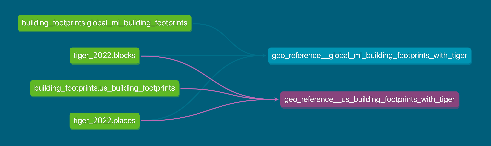

# dbt (data build tool)

## Part IV: dbt docs and mart models

### dbt docs

A key feature of dbt is the automated generation of documentation and lineage from your project. The source and ref functions we taught you about allow us to see the connectedness of our data in a DAG (Directed Acyclic Graph) or lineage graph. We can see from source all the way to a downstream model what models and other sources are dependencies.

Here's an example DAG from our team's [data-infrastructure project](https://github.com/cagov/data-infrastructure).

#### Rendering your docs as static HTML

dbt reads your SQL models and YAML configuration files and produces a static HTML document from them.
This documentation can then be hosted in a number of places, including dbt Platform, GitHub Pages, Azure Static Web Apps, etc. Here is an example that demonstrate dbt docs being hosted on [GitHub Pages](https://cagov.github.io/data-infrastructure/dbt_docs_snowflake/#!/overview) and [the code](https://github.com/search?q=repo%3Acagov%2Fdata-infrastructure%20dbt_docs_snowflake&type=code) that makes it happen.

To generate docs locally, run: `dbt docs generate` then `dbt docs serve`

### Mart models

**Purpose:** Create consumable datasets tailored for specific business or program needs. Mart models are also known as an entity layer or business layer.

**Key characteristics:**

- Represent a specific entity or concept at its unique grain
- Wide and denormalized (fewer joins for end users)
- Program-friendly naming
- Optimized for querying and reporting

**Examples:**

- `stations` (one row per monitoring station)
- `lab_results` (one row per lab result)
- `samples` (one row per sample)
- `parameters` (one row per water quality parameter)

**Organization and naming:**

- Saved in a `marts/` subdirectory
- Often organized by business domain (e.g., `marts/water_quality/`, `marts/geo/`)
- Plain English based on the program/entity
- No prefixes for model files needed e.g. `stations.sql`, not `mart_stations.sql`

**Materialization:**

- Tables (marts need to be fast for end users)
- Consider incremental for very large datasets

### Designing good mart models

**1. Clear grain**

- One row per what?
- Document the grain explicitly

**2. Business-friendly names**

- Avoid abbreviations: `station_name` not `stn_nm`
- Avoid technical jargon: `sample_date` not `sys_crt_ts`

**3. Complete context**

- Include all fields users need rather than make them join to other tables

**4. Well tested**

- Test the grain (uniqueness on primary key)
- Test relationships to upstream models
- Test accepted values for categorical fields

**5. Well documented**

- Explain what the mart represents
- Document calculated fields
- Note any limitations or filters applied

### Summary of the layered modeling approach (staging, intermediate, mart)

| Layer | Purpose | Transformations | Naming |
|-------|---------|-----------------|--------|
| **Staging** | One-to-one with source | Renaming, type casting | `stg_<source>__<entity>`
| **Intermediate** | Reusable business logic | Joins, aggregations | `int_<description>`
| **Mart** | Business-ready datasets | Denormalization, final calcs | Plain English

### Practice

#### Create first mart model and YAML docs

!!! abstract "Create and document your first mart model"

    **SQL:**

    1. If not already on your working branch, switch to it: `git switch <your-first-name>-dbt-training`
    1. Open `transform/models/3_marts/stations_per_county.sql`, you should see a basic select statement
    1. Write a SQL query to return a count of unique stations per county sorted from greatest to least
    1. Structure your query so that the main part of it is in a CTE, from which you `select *` at the end

    **_Hints_**

    1. This will make use of a SQL group by and aggregation
    1. Your output table should have 2 columns
    1. Use Snowflake’s [count()](https://docs.snowflake.com/en/sql-reference/functions/count) function

    **YAML:**

    1. Document your new intermediate model in the `transform/models/2_intermediate/_int_water_quality.yml` file
    1. Materialize your model as a table
    1. Add a description explaining this model
    1. Add column descriptions for the fields the model outputs (you can copy/paste from `_stg_water_quality.yml` where definitions have remain unchanged)

=== "dbt Core"

    1. _Lint_ and _Format_ your files
        1. You can lint your SQL files by navigating to the transform directory and running: `sqlfluff lint models/3_marts`
        1. You can fix your SQL files (at least the things that are easy to fix) by remaining in the transform directory and running `sqlfluff fix models/3_marts`

    Any of the above steps may modify your files requiring you to stage (`git add`) them again.

    1. Check to see which files need to be added or removed: `git status`
    1. Add or remove any relevant files: `git add filename.ext` or `git rm filename.ext`
    1. Commit your code and leave a concise, yet descriptive commit message: `git commit -m "example message"`
        1. During this step pre-commit may catch an error you missed. It may auto-fix your file or you may have to do it yourself. Regardless you will have to repeat `git add...` (for each modified file) and `git commit...`.
    1. Push your code: `git push origin <your-first-name>-dbt-training`

=== "dbt Platform"

    1. Click the _Lint_ and _Fix_ buttons to check and edit your files
    1. Save any changes made by clicking "Save" or using a keyboard shortcut
    1. Commit and sync your code
    1. Leave a concise, yet descriptive commit message

### Knowledge check

#### Question #1

  
What is the primary purpose of mart models in dbt?

  <ul class="quiz-options">
    <li class="quiz-option" data-correct="false">Provide a one-to-one representation of source data</li>
    <li class="quiz-option" data-correct="false">Apply reusable business logic for downstream models</li>
    <li class="quiz-option" data-correct="true">Create consumable, business-ready datasets tailored for specific needs</li>
    <li class="quiz-option" data-correct="false">Store raw data from external sources</li>
  </ul>
  

    <strong>Explanation:</strong> Mart models create business-ready datasets that are wide, denormalized, and optimized for querying and reporting. They represent specific entities or concepts at their unique grain and are designed for direct consumption by end users.
  

#### Question #2

  
Why is documentation important in data projects?

  <ul class="quiz-options">
    <li class="quiz-option" data-correct="false">It is required by dbt to run models successfully</li>
    <li class="quiz-option" data-correct="false">It automatically improves query performance</li>
    <li class="quiz-option" data-correct="true">It helps team members understand data, builds trust, and preserves knowledge</li>
    <li class="quiz-option" data-correct="false">It replaces the need for data testing</li>
  </ul>
  

    <strong>Explanation:</strong> Documentation helps new team members understand the data, helps future you remember what you built and why, ensures stakeholders know what data means, and builds trust in data quality. Good documentation preserves institutional knowledge and makes data projects maintainable over time.
  

#### Question #3

  
Which of the following is a best practice when designing mart models?

  <ul class="quiz-options">
    <li class="quiz-option" data-correct="false">Use technical abbreviations to save space (e.g., <code>cust_nm</code> instead of <code>customer_name</code>)</li>
    <li class="quiz-option" data-correct="false">Keep tables normalized to minimize data duplication</li>
    <li class="quiz-option" data-correct="true">Include all fields users need so they don't have to join to other tables</li>
    <li class="quiz-option" data-correct="false">Prefix all mart models with <code>mart_</code> for clarity</li>
  </ul>
  

    <strong>Explanation:</strong> Mart models should be wide and denormalized with complete context, including all fields users need. This avoids requiring end users to perform joins. Use business-friendly names without abbreviations, and use plain English naming without prefixes like <code>mart_</code>.
  

### References

#### Documentation

- [What is documentation?](https://platform.thinkific.com/videoproxy/v1/play/c71iuqg40bhpn3t11p80)
- [Writing documentation and doc blocks](https://platform.thinkific.com/videoproxy/v1/play/ce2dchnf17fhkgqdq59g)
- [Marts: Business-defined entities](https://docs.getdbt.com/best-practices/how-we-structure/4-marts)

<!-- code for page navigation -->

  <a href="../pt-iii-materializations-and-intermediate-models/" class="nav-button prev">Part III</a>
  <a href="../pt-v-environments-jobs-ci-cd-and-custom-schemas/" class="nav-button next">Part V</a>

