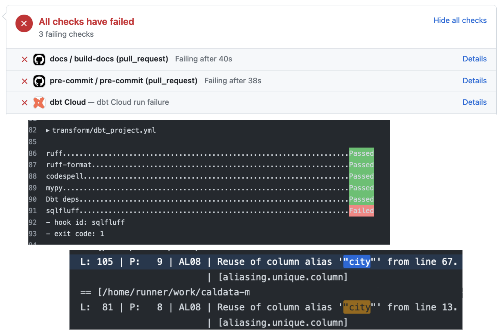

# dbt (data build tool)

## Part V: Environments, jobs, CI/CD, and custom schemas

### Environments in Snowflake

During step 2 of the [learning path](../../learning-path.md#step-2-learn-about-concepts-and-tools-3-hrs) we had you read a bit about Snowflake architecture. In that content, we briefly introduced the concept of _environments_. Broadly speaking, environments are a collection of compute resources, software, and configuration, which together represent a functioning context for development. Examples of environments include:

1. A **production** environment which is used to run the dbt models that have been merged to `main`. This can be run on an ad-hoc basis, or can be run on a schedule to ensure that models are never more than some amount of time old.
1. A **development** environment, which is used to run tests on branches and pull requests, and can help to catch bugs and regressions before they are deployed to production.
1. A **user acceptance testing (UAT)** environment, which can be used as a final testing environment for verifying code before it is deployed to production.

These definitions are intentionally broad, since there are lots of different ways environments can be set up! Depending on your situation, different environments in Snowflake could be represented by:

- entirely different accounts
- different databases within the same account, or even
- different schemas within the same database.

In our default MDSA architecture we have two environments, _dev_ and _prod_, which reside in the same Snowflake account. Each of these environments consists of a set of databases corresponding to our layered [data architecture](../../cloud-data-warehouses/snowflake.md#snowflake-architecture).

### Environments in dbt Platform

dbt Platform also has a concept of an Environment, which is a virtual machine in dbt Platform that has all of the relevant software dependencies and environment variables set. Roughly speaking, an environment in dbt Platform will correspond to one of your environments in Snowflake.

If using dbt Platform, you’ve already encountered one environment, your _Develop: Cloud IDE_. But you can create other environments in dbt Platform for various purposes. Our typical dbt Platform setup includes the following environments:

- Development, which uses the "dev" Snowflake environment. This is what you use when you work in the cloud IDE.
- Production, which uses the "prod" Snowflake environment. This is what we use to build production data models.
- Continuous Integration, which uses the "dev" Snowflake environment. This is what runs the automated CI checks.

### Jobs

A _job_ is a command or series of commands that run in a given environment. Examples of jobs we often use include:

- Running a nightly build of data models
- Running Continuous Integration – CI checks (see below!)
- Building project docs

Jobs can be configured in a number of ways: they can have different environment variables set, they can run on a schedule, or they can be triggered by a specific action like a pull request being opened, or a branch being merged.

### Continuous Integration and Continuous Deployment (CI/CD)

#### Continuous Integration (CI)

Continuous Integration checks in GitHub, Azure DevOps, BitBucket, or similar are automated tests that are run against your code every time you push a change. They are an important part of the software development process, and can help you:

- **Catch errors and issues early:** CI checks can identify issues with your code before they can cause problems in production.
- **Improve code quality:** CI checks can help you to improve the quality of your code by identifying issues like duplicate or dead code and potential security vulnerabilities.
- **Establish a house style:** CI checks can enforce various code formatting rules and conventions that your team has agreed upon.

We usually set up git repositories so that PRs cannot be merged to `main` unless these checks pass. This can sometimes feel annoying! However, CI checks shouldn’t feel too painful or like a box-checking exercise. They are intended to be a routine and helpful part of the development process.

When interpreting CI failures, you want to take an investigative approach. In GitHub, you can click on the "Details" for a failing check. Those details should tell you which check failed and the logs should contain any error messages.



Ultimately, experience has shown that effective use of CI greatly speeds up development.

#### Continuous Deployment (CD)

Continuous Deployment (CD) in most of our MDSA projects is usually simple. We typically do not build any applications or deploy cloud resources. Instead, whatever is in the `main` branch is considered _production_, and our dbt projects and docs are built using that.

Here is a 4 minute video that goes a bit deeper into the CI/CD process with accompanying visuals.

<video width="100%" controls>
<source src="../../../media/ci_cd_slides_1.mp4" type="video/mp4">
Your browser does not support the video tag.
</video>


### Custom schema names

Database **schemas** are the primary way of organizing database objects (e.g., tables and views).
You can think of them like folders in your database.
Different teams choose different schema structures for their data warehouses:
they might be broken down by data source type, by line of business, or by phase of a data pipeline.
In many CalData projects we choose schema names corresponding to data sources in the earlier phases of the pipeline,
and schema names corresponding to lines of business in the later phases.

!!! note
    Unfortunately, the word "schema" has two different meanings in data warehousing.
    One refers to the folder-like unit of organization,
    the other refers to the column names and data types of a given table or view.
    In this section we are only referring to the first definition.

#### Choosing a schema name for a model

dbt allows you to choose the schema that a model is built in using the model configuration.
This configuration can be set in the same places as other config values,
such as [materialization](pt-iii-materializations-and-intermediate-models.md#where-to-configure-materializations).

We usually choose to configure the schema name per-folder in the `dbt_project.yml`:

```yaml
# in the dbt_project.yml file...
models:
  dse_analytics:
    staging:
      +schema: staging
    intermediate:
      +schema: intermediate
    marts:
      +schema: marts
```

The above builds all models in the `staging` directory in a schema called `staging`,
all models in the `intermediate` directory in a schema called `intermediate`,
and all models in the `marts` directory in a schema called `marts`.
It uses a 1:1 convention between folder name and schema name for clarity,
but we are free to choose other conventions if we want to.
If you need more granular control on schema name, you can configure it more specifically for individual models.

#### Development schema names

One of dbt's most useful features is the ability to provide *safe development environments*,
where individual analytics engineers can create new data models and change existing models
without stepping on each others' toes or breaking production models.
The name of your individual development schema is configured in your [dbt profile](../../code/local-dev-setup.md/#4-configure-dbt).
By convention, this individual development schema is called `DBT_YOURNAME`.
When you build a dbt project, you will see your models under a schema with that name (e.g., `DBT_JDOE`).

But wait! How does your development schema name interact with the custom schema name configuration from the previous section?
By [default](https://docs.getdbt.com/docs/build/custom-schemas?version=2.0&name=Fusion)
dbt prepends the active dbt profile name to the custom schema name.
For example, if your profile schema shows `DBT_YOURNAME` and the custom schema for a model is `MARTS`,
the model will be built in `DBT_YOURNAME_MARTS`.


!!! note
    There is one situation where most CalData projects depart from dbt defaults:
    in the **production** environment (indicated by a target name of `prd` in a dbt profile)
    we do *not* prepend the profile schema name.
    This behavior is configured using [this](https://github.com/cagov/data-infrastructure/blob/main/transform/macros/get_custom_schema.sql) macro.
    The rationale for this is that schema names are often external-facing (in that they are seen
    by analysts and BI users) and should be as simple and easy to understand as possible.

#### CI schema names

One typical job for CI tests is to run a dbt project and ensure that all models build successfully.
In the case of a failure, you should be able to go to your data warehouse and inspect the actual tables and views that were built.
In CI the dbt profile schema name is usually set to indicate where the schema came from.
For instance, when you use dbt Platform, the profile schema is set to `DBT_CLOUD_PR_<PRNUM>`,
where `<PRNUM>` is the number of the pull request in your version control platform.
Schema names for CI runs are prepended to custom schema names in the same way they are for individual developers.

### Knowledge check

#### Question #1

<div class="quiz-container">
  <div class="quiz-question">What does an environment represent in data and software engineering?</div>
  <ul class="quiz-options">
    <li class="quiz-option" data-correct="false">A specific database table where data is stored</li>
    <li class="quiz-option" data-correct="true">A collection of compute resources, software, and configuration representing a functioning development context</li>
    <li class="quiz-option" data-correct="false">A scheduling tool for running data pipelines</li>
    <li class="quiz-option" data-correct="false">A version control system for tracking code changes</li>
  </ul>
  <div class="quiz-explanation">
    <strong>Explanation:</strong> An environment is a collection of compute resources, software, and configuration which together represent a functioning context for development. Common examples include production environments (for running merged code), development environments (for testing branches and PRs), and UAT environments (for final verification before production deployment).
  </div>
</div>

#### Question #2

<div class="quiz-container">
  <div class="quiz-question">Why are repositories typically configured so that pull requests cannot be merged to main unless CI checks pass?</div>
  <ul class="quiz-options">
    <li class="quiz-option" data-correct="false">To slow down the development process and give teams more time to review</li>
    <li class="quiz-option" data-correct="true">To prevent code with errors, quality issues, or style violations from reaching production</li>
    <li class="quiz-option" data-correct="false">Because only some people can deploy code to production</li>
    <li class="quiz-option" data-correct="false">To ensure documentation for the codebase is built first</li>
  </ul>
  <div class="quiz-explanation">
    <strong>Explanation:</strong> CI checks help catch errors early, improve code quality, and enforce code formatting rules and conventions. Requiring these checks to pass before merging prevents problematic code from reaching production. While this may sometimes feel restrictive, experience has shown that effective use of CI/CD greatly speeds up development by catching issues before they cause problems in production.
  </div>
</div>

#### Question #3

<div class="quiz-container">
  <div class="quiz-question">What is the primary purpose of Continuous Integration (CI) checks?</div>
  <ul class="quiz-options">
    <li class="quiz-option" data-correct="false">To deploy code to production automatically</li>
    <li class="quiz-option" data-correct="false">To schedule nightly data builds</li>
    <li class="quiz-option" data-correct="true">To catch errors and issues early before they reach production</li>
    <li class="quiz-option" data-correct="false">To create custom schema names</li>
  </ul>
  <div class="quiz-explanation">
    <strong>Explanation:</strong> Continuous Integration (CI) checks are automated tests that run against your code every time you push a change. They help catch errors and issues early, improve code quality, and establish a house style. CI checks run before code is merged to production, helping prevent bugs from reaching production environments.
  </div>
</div>

#### Question #4

<div class="quiz-container">
  <div class="quiz-question">If your dbt profile schema name is set to <code>DBT_JDOE</code> and a model has a custom schema configured to <code>REPORTS</code>, what is the final schema name when you build the model as a developer?</div>
  <ul class="quiz-options">
    <li class="quiz-option" data-correct="true"><code>DBT_JDOE_REPORTS</code></li>
    <li class="quiz-option" data-correct="false"><code>REPORTS_DBT_JDOE</code></li>
    <li class="quiz-option" data-correct="false"><code>DBT_JDOE</code></li>
    <li class="quiz-option" data-correct="false"><code>REPORTS</code></li>
  </ul>
  <div class="quiz-explanation">
    <strong>Explanation:</strong> In development, all models are built in schemas prefixed with the name set in your dbt profile. By convention, we set this to <code>DBT_YOURNAME</code>. This is so that multiple people can develop alongside each other without building conflicting models: their individual work is isolated in different schemas.
  </div>
</div>

#### Question #5


<div class="quiz-container">
  <div class="quiz-question">In production, the dbt profile schema name is set to <code>ANALYTICS</code> and a model has a custom schema configured to <code>REPORTS</code>, what is the final schema name when this is built in CD?</div>
  <ul class="quiz-options">
    <li class="quiz-option" data-correct="false"><code>ANALYTCS_REPORTS</code></li>
    <li class="quiz-option" data-correct="false"><code>REPORTS_ANALYTICS</code></li>
    <li class="quiz-option" data-correct="false"><code>ANALYTICS</code></li>
    <li class="quiz-option" data-correct="true"><code>REPORTS</code></li>
  </ul>
  <div class="quiz-explanation">
    <strong>Explanation:</strong> In production we set the schema to the custom schema name without modification. This is different from dbt's defaults. We do this because schema names are often external-facing and should be as simple and easy to understand as possible.
  </div>
</div>

### References

#### Key pairs for CI

- [Creating key pairs for service accounts that run CI and Production jobs](https://docs.snowflake.com/en/user-guide/key-pair-auth#configuring-key-pair-authentication)

<!-- code for page navigation -->
<div class="page-navigation">
  <a href="../pt-iv-dbt-docs-and-mart-models/" class="nav-button prev">Part IV</a>
  <div class="nav-spacer"></div>
</div>
