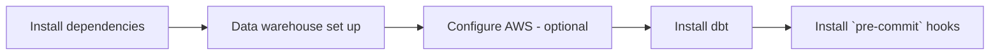

# Local repository setup

Working with dbt Core will involve more than just its installation. We have included additional instructions for individual contributors to set up their local repository to work well with dbt, their data warehouse, and a git-based version control workflow with checks that can be run on the code before opening a PR.

Here's a diagram of the steps you can expect to take:



## 1. Install dependencies

### 1. Set up a Python virtual environment

Much of the software in this project is written in Python.
It is usually worthwhile to install Python packages into a virtual environment,
which allows them to be isolated from those in other projects which might have different version constraints.

We recommend [`uv`](https://docs.astral.sh/uv/).

For both Windows and MacOS users it can be installed via [Homebrew](https://brew.sh/) with the following command:

```bash
brew install uv
```

### 1. Install go dependencies (Optional)

ODI uses [Terraform](https://www.terraform.io/) to manage infrastructure.
Dependencies for Terraform (mostly in the [go ecosystem](https://go.dev/))
can be installed via a number of different package managers.

If you are running Mac OS, you can install these dependencies with Homebrew.

Install Homebrew, if you don't already have it, with the following snippet:

```bash
/bin/bash -c "$(curl -fsSL https://raw.githubusercontent.com/Homebrew/install/HEAD/install.sh)"
```

Install the go dependencies:

```bash
brew install terraform terraform-docs tflint go
```

Validate the install with:

```bash
terraform -v

go version
```

## 1. Data warehouse set up

### 1. Configure Snowflake

In order to use Snowflake (as well as the terraform validators for the Snowflake configuration)
you should set some default local environment variables in your environment.
This will depend on your operating system and shell. For Linux and Mac OS systems,
as well as users of Windows subsystem for Linux (WSL) it's often set in
`~/.zshrc`, `~/.bashrc`, or `~/.bash_profile`.

If you use zsh or bash, open your shell configuration file, and add the following lines:

#### Transformer role (default)

```bash
# Legacy account identifier
export SNOWFLAKE_ACCOUNT=<account-locator>
# The preferred account identifier is to use name of the account prefixed by its organization (e.g. myorg-account123)
# Supporting snowflake documentation - https://docs.snowflake.com/en/user-guide/admin-account-identifier
export SNOWFLAKE_ACCOUNT=<org_name>-<account_name> # format is organization-account
export SNOWFLAKE_DATABASE=TRANSFORM_DEV
export SNOWFLAKE_USER=<your-username> # this should be your OKTA email
export SNOWFLAKE_PASSWORD=<your-password> # this should be your OKTA password
export SNOWFLAKE_ROLE=TRANSFORMER_DEV
export SNOWFLAKE_WAREHOUSE=TRANSFORMING_XS_DEV
export SNOWFLAKE_AUTHENTICATOR=ExternalBrowser
```

This will enable you to perform transforming activities which are needed for dbt.
Open a new terminal and verify that the environment variables are set.

#### Loader role

```bash
# Legacy account identifier
export SNOWFLAKE_ACCOUNT=<account-locator>
# The preferred account identifier is to use name of the account prefixed by its organization (e.g. myorg-account123)
# Supporting snowflake documentation - https://docs.snowflake.com/en/user-guide/admin-account-identifier
export SNOWFLAKE_ACCOUNT=<org_name>-<account_name> # format is organization-account
export SNOWFLAKE_DATABASE=RAW_DEV
export SNOWFLAKE_USER=<your-username> # this should be your OKTA email
export SNOWFLAKE_PASSWORD=<your-password> # this should be your OKTA password
export SNOWFLAKE_ROLE=LOADER_DEV
export SNOWFLAKE_WAREHOUSE=LOADING_XS_DEV
export SNOWFLAKE_AUTHENTICATOR=ExternalBrowser
```

This will enable you to perform loading activities which are needed for Airflow or Fivetran.
Again, open a new terminal and verify that the environment variables are set.

## 1. Configure AWS (optional)

In order to create and manage AWS resources programmatically,
you need to create access keys and configure your local setup to use them:

1. [Install](https://docs.aws.amazon.com/cli/latest/userguide/getting-started-install.html) the AWS command-line interface.
1. Go to the AWS IAM console and [create an access key for yourself](https://docs.aws.amazon.com/IAM/latest/UserGuide/id_credentials_access-keys.html#Using_CreateAccessKey).
1. In a terminal, enter `aws configure`, and add the access key ID and secret access key when prompted. We use `us-west-2` as our default region.

## 1. Install dbt

Follow the instructions [here](https://docs.getdbt.com/docs/core/installation-overview) to install dbt locally.

The connection information for your data warehouses will, in general, live outside of this repository.
This is because connection information is both user-specific and usually sensitive,
so it should not be checked into version control.

In order to run this project locally, you will need to provide this information
in a YAML file. Run the following command to create the necessary folder and file.

```bash
mkdir ~/.dbt && touch ~/.dbt/profiles.yml
```

TODO: This will only work on posix-y systems. Windows users will have a different command.

Instructions for writing a `profiles.yml` are documented
[here](https://docs.getdbt.com/docs/get-started/connection-profiles),
there are specific instructions for Snowflake
[here](https://docs.getdbt.com/reference/warehouse-setups/snowflake-setup), and you can find examples below as well.

You can verify that your `profiles.yml` is configured properly by running the following command in the project root directory (`transform`).

```bash
uv run dbt debug
```

### Set up dbt deferral

In order to defer to our production tables, dbt has to know what tables are in our production environment (remember, there will, in general, be some differences between production and your dev branches, because you are making changes in your dev branches!)

TODO: How to do this without access to dbt Cloud.

### dbt and your data warehouse

#### 1. For Snowflake projects

A minimal version of a `profiles.yml` for dbt development is:

```yml
dse_snowflake:
  target: dev
  outputs:
    dev:
      type: snowflake
      account: <account-locator>
      user: <your-username>
      password: <your-password>
      authenticator: username_password_mfa
      role: TRANSFORMER_DEV
      database: TRANSFORM_DEV
      warehouse: TRANSFORMING_XS_DEV
      schema: DBT_<your-name>   # Test schema for development
      threads: 4
```

!!! note
    The target name (`dev`) in the above example can be anything.
    However, we treat targets named `prd` differently in generating
    custom dbt schema names (see [here](../dbt/dbt.md#custom-schema-names)).
    We recommend naming your local development target `dev`, and only
    include a `prd` target in your profiles under rare circumstances.

You can include profiles for several databases in the same `profiles.yml`,
(as well as targets for production), allowing you to develop in several projects
using the same computer.

### 1. VS Code setup (optional)

Many people prefer to use featureful editors when doing local development so we included an example set up with VS Code. By equipping a text editor like VS Code with an appropriate set of extensions and configurations
we can largely replicate the dbt Cloud experience locally.
Here is one possible configuration for VS Code:

1. Install some useful extensions (this list is advisory, and non-exhaustive):
    * dbt Power User (query previews, compilation, and auto-completion)
    * Python (Microsoft's bundle of Python linters and formatters)
    * sqlfluff (SQL linter)
1. Configure the VS Code Python extension to use your virtual environment by choosing `Python: Select Interpreter` from the command palette and selecting your virtual environment (`infra`) from the options.
1. Associate `.sql` files with the `jinja-sql` language by going to `Code` -> `Preferences` -> `Settings` -> `Files: Associations`, per [these](https://github.com/innoverio/vscode-dbt-power-user#associate-your-sql-files-the-jinja-sql-language) instructions.
1. Test that the `vscode-dbt-power-user` extension is working by opening one of the project model `.sql` files and pressing the "▶" icon in the upper right corner. You should have query results pane open that shows a preview of the data.

## 1. Install `pre-commit` hooks

This project uses [pre-commit](https://pre-commit.com/) to lint, format,
and generally enforce code quality. These checks are run on every commit,
as well as in CI.

To set up your pre-commit environment locally run the following in the `data-infrastructure` repo root folder:

```bash
pre-commit install
```

The next time you make a commit, the pre-commit hooks will run on the contents of your commit
(the first time may be a bit slow as there is some additional setup).

You can verify that the pre-commit hooks are working properly by running the following snippet to test every file in the repository against the checks.

```bash
pre-commit run --all-files
```

Some of the checks lint our dbt models and Terraform configurations,
so having the terraform dependencies installed and the dbt project configured
is a requirement to run them, even if you don't intend to use those packages.
