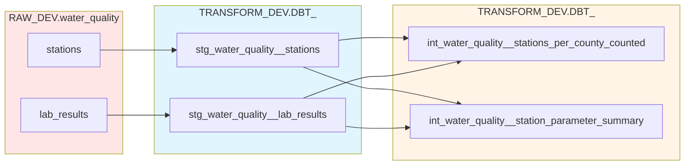

This guide walks you through the complete path you will take to learn data and analytics engineering concepts and skills as well as modern data tooling.

!!! clock "Estimated Time: 16 hours (self-paced)"

---

## Your journey

### Step 1: Learn about concepts and tools (~3 hrs)

1. Read through the [concepts and tools](concepts-tools.md) guide (required)

1. Understand [git](code/git.md) fundamentals (optional)
      - Read this if you are new to git and version control or if you need a refresher

1. Learn about GitHub (optional)
      - If you are completely new to this go through the [GitHub tutorials we've curated](code/platforms/github-tutorials.md)
      - If you only need a refresher keep our [GitHub](code/platforms/github.md) guide handy for easy reference

1. Read about the Snowflake RAW/TRANSFORM/ANALYTICS structure (required)
      - [Snowflake architecture](cloud-data-warehouses/snowflake.md##odi-snowflake-architecture)
      - [Databases and schemas](cloud-data-warehouses/snowflake.md#databases-and-schemas)

---

### Step 2: Set up your local development environment (~2 hrs)

1. Complete your [local dev setup](code/local-dev-setup.md)
      - Complete the entire setup guide
      - You'll configure: a python environment, dbt, Snowflake connection, pre-commit hooks

    !!! Note
        If you did hands-on sessions with us to set up Snowflake architecture and CI/CD you may have already done some of this, please go through it anywayd to ensure you have not missed a step.  
        If your full team was not present for those sessions they will need to complete this step.

**Checkpoint:** Can you run `dbt debug` successfully? You should not move forward until this is successful.

---

### Step 3: Create your first staging models (~3 hrs)

1. [Part I: Foundations and staging models](data-transformation/dbt/pt-i.md)
      - Learn about dbt, data modeling, and what staging models are
      - Complete the knowledge check section
          - For any incorrect answers: Review content and research topics to solidy your understanding before moving forward
      - Complete the practice section
          - Review the answer key. For questions you got wrong, try to understand how your model and the answer key model are different. What is the grain of your model? For answers, you got correct, but solved differently, note the distinctions. It's okay to arrive at the right answer with a different method, we only want you to be aware of other solutions. If you think your solution is more readable or performant, let us know!

**Checkpoint:** Can you run `dbt run` successfully? You should have 2 staging models that build.

---

### Step 4: Write YAML docs and dbt tests (~2 hrs)

1. [Part II: YAML documentation and testing](data-transformation/dbt/pt-ii.md)
      - Learn about YAML configuration files and their structure, documentation, and dbt tests
      - Complete the knowledge check section
          - For any incorrect answers: Review content and research topics to solidy your understanding before moving forward
      - Complete the practice section
          - Review the answer key. For questions you got wrong, try to understand how your model and the answer key model are different. What is the grain of your model? For answers, you got correct, but solved differently, note the distinctions. It's okay to arrive at the right answer with a different method, we only want you to be aware of other solutions. If you think your solution is more readable or performant, let us know!

**Checkpoint:** Can you run `dbt test` and see passing tests?

---

### Step 5: Learn about model materializations and create an intermediate model (~2 hrs)

1. [Part III: Materializations and intermediate models](data-transformation/dbt/pt-iii.md)
      - Learn how to materialize your models and why for each choice and what intermediate models are
      - Complete the knowledge check section
          - For any incorrect answers: Review content and research topics to solidy your understanding before moving forward
      - Complete the practice section
          - Review the answer key. For questions you got wrong, try to understand how your model and the answer key model are different. What is the grain of your model? For answers, you got correct, but solved differently, note the distinctions. It's okay to arrive at the right answer with a different method, we only want you to be aware of other solutions. If you think your solution is more readable or performant, let us know!

**Checkpoint:** Can you run `dbt build` and see passing models and tests?

---

### Step 6: View your YAML docs as HTML and build a mart model (~2 hrs)

1. [Part IV: dbt docs and mart models](data-transformation/dbt/pt-iv.md)
      - Learn how to render your YAML documentation and what mart models are
      - Complete the knowledge check section
          - For any incorrect answers: Review content and research topics to solidy your understanding before moving forward
      - Complete the practice section
          - Review the answer key. For questions you got wrong, try to understand how your model and the answer key model are different. What is the grain of your model? For answers, you got correct, but solved differently, note the distinctions. It's okay to arrive at the right answer with a different method, we only want you to be aware of other solutions. If you think your solution is more readable or performant, let us know!
      - Open a PR
          - Push your branch to GitHub
          - Open a pull request with your staging models
          - Request review (or self-review to understand the process)

<!-- TODO: fill in the model select below -->
**Checkpoint:** Can you run `dbt build --select xx` and see passing models and tests? Do you have an open PR with your code?

---

### Step 7: Learn about environments, jobs, CI/CD, and custom schemas (~2 hrs)

1. [Part V: Environments, jobs, CI/CD, and custom schemas](data-transformation/dbt/pt-v.md)
      - Review your PR
      - If your check marks are red:
          1. Click through to understand the error
          1. Resolve the error locally
          1. Commit and push your changes
          1. Repeat the above steps until your check marks are ALL green

**Checkpoint:** Does your PR have passing CI checks?

---

## You've completed the training!

You now have skills in

- Version control with git & GitHub ✅
- Data transformation with dbt ✅
- Working with Snowflake ✅
- Automated testing with CI/CD ✅
- Code review and collaboration ✅

and your final training pipeline should look like this:

---

## Next steps

- Apply these skills to your organization's data
- Explore [advanced dbt topics](data-transformation/dbt/advanced/macros-custom-tests.md)

---

## Using a different data warehouse?

Currently this training uses Snowflake. The dbt and git concepts remain the same, but SQL syntax may differ slightly.
