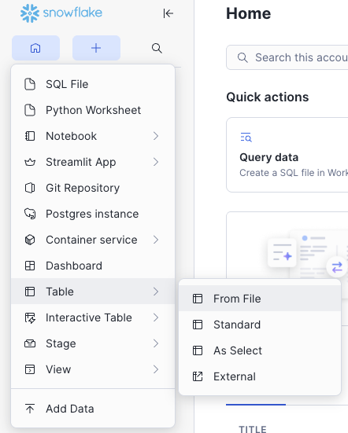
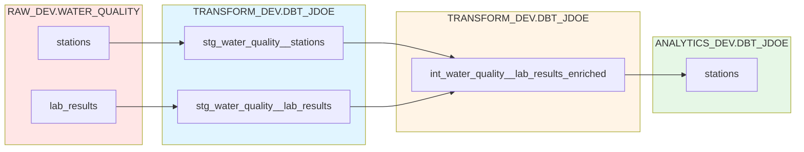

This guide walks you through the complete path you will take to learn data and analytics engineering concepts and skills as well as modern data tooling. If at any point throughout this training you get stuck, feel free to ask questions in our [Teams channel](https://teams.microsoft.com/l/channel/19%3A9UzMH9e4ZArvv3-GA6PeAVj78dpC1PeWheOZQ71cJCA1%40thread.tacv2/Discussion?groupId=d481f5d0-9e47-4dd0-9695-1b70a396c4f4&tenantId=e8c9327a-25cd-469b-ac57-455f3bd12bd1).

!!! clock "Estimated Time: 16 hours (self-paced)"

---

## Your journey

### Step 1: Download the training repo

Clone the practice repository to your local machine, we recommend at the root of your computer, but you can download it anywhere you'll remember to access it. All commands in the rest of this training will assume you have cloned the repo at your computer root. If you did not you'll have to make custom changes to the example commands on your own.

To clone it to your root, first run:

```bash
cd ~
```

Next, run:

```bash
git clone https://github.com/cagov/caldata-mdsa-training-practice.git
```

Then navigate into the repo:

``` bash
cd caldata-mdsa-training-practice
```

This repository contains:

- A complete dbt project with staging and intermediate models
- A Python script for loading data into Snowflake
- All configuration files needed to run dbt locally

#### Step 1a: Load the data to Snowflake (one team member)

This is intended for only one person on the team to do. This one person should have the correct permissions to load data into the `RAW_DEV` database and create schemas. After this step is complete the entire team going through this training will be able to use this data.

##### Loading Stations data

1. Click the following links to download the training data as `.csv` files
    1. [Stations](https://data.ca.gov/dataset/water-quality-data/resource/07ba626a-0bc8-4ce9-b6ac-3f29ce3c8e6f)
    1. [Lab Results](https://data.ca.gov/dataset/water-quality-data/resource/bf00a754-7be7-4360-a470-bbf151aac62c)
1. In Snowflake, on the bottom of the left pane beneath your name/initials, switch to the `LOADER_DEV` role
1. Navigate to _Catalog_ on the left pane and click on the `RAW_DEV` database
    1. Click the blue _+ Schema_ button at the top right
    1. Input `WATER_QUALITY` then click _Create_
1. Next, navigate to the top of the left pane and click the `+` symbol
    1. Scroll to _Table_ then click _From File_

1. Select/input the following:
    Warehouse: `LOADING_XS_DEV`
    Database: `RAW_DEV`
    Schema: `WATER_QUALITY`
    Create new table > Name: `STATIONS`
1. Review load settings, then click _Next_
1. On the next screen, make sure _Delimited Files (CSV or TSV)_ is selected for _File format_
1. Leave everything else unchanged and click _Load_

##### Loading Lab Results data

Please follow the steps for loading stations data first before loading lab results data.

1. Set up environment variables for Snowflake authentication. Add these to your shell config (`~/.zshrc`, `~/.bashrc`, or `~/.bash_profile`):

   ```bash
   export SNOWFLAKE_ACCOUNT=<org_name>-<account_name>
   export SNOWFLAKE_USER=<your-username>
   export SNOWFLAKE_AUTHENTICATOR=externalbrowser  # or username_password_mfa
   export SNOWFLAKE_DATABASE=RAW_DEV
   export SNOWFLAKE_WAREHOUSE=<warehouse-name>
   export SNOWFLAKE_ROLE=LOADER_DEV
   ```

   Open a new terminal or run `source ~/.zshrc` (or your shell config file) to apply the changes.

2. In your terminal, run the Python script to load the data:

   ```bash
   cd caldata-mdsa-training-practice
   uv sync  # Install dependencies if you haven't already
   uv run python python/load_water_quality_data.py
   ```

   !!! note
       This script downloads lab results data from data.ca.gov and loads it into `RAW_DEV.WATER_QUALITY.LAB_RESULTS_TEST_2026`. The download may take a few minutes for large datasets.

**Checkpoint:** Verify that both tables have loaded correctly by navigating to _Catalog_ > `RAW_DEV` database > `WATER_QUALITY` schema. Click _Data Preview_ to review each table. Validate row counts match with what you see on the data.ca.gov links above.

### Step 2: Learn about concepts and tools (~3 hrs)

1. Read through the [concepts and tools](concepts-tools.md) guide (required)

1. Understand [git](code/git.md) fundamentals (optional)
      - Read this if you are new to git and version control or if you need a refresher

1. Learn about GitHub (optional)
      - If you are completely new to this go through the [GitHub tutorials we've curated](code/platforms/github-tutorials.md)
      - If you only need a refresher keep our [GitHub](code/platforms/github.md) guide handy for easy reference

1. Read about the Snowflake architecture after which we model the data warehouse (required)
      1. Read this section [Databases and schemas](cloud-data-warehouses/snowflake.md#databases-and-schemas) all the way through _Defaults_
      1. Read this section, [Snowflake architecture](cloud-data-warehouses/snowflake.md#odi-snowflake-architecture), all the way through _Visualizing the ODI context_

    !!! Note
        You only need to read about the thrtwoee sections we linked to above, not the entirety of the Snowflake page.

---

### Step 3: Set up your local development environment (~2 hrs)

1. Complete your [local dev setup](code/local-dev-setup.md)
      - Complete the entire setup guide
      - You'll configure: a python environment, dbt, Snowflake connection, pre-commit hooks

    !!! Note
        If you did hands-on sessions with us to set up Snowflake architecture and CI/CD you may have already done some of this, please go through it anywayd to ensure you have not missed a step. <br/>
        If your full team was not present for those sessions they will need to complete this step.

**Checkpoint:** Can you run `dbt debug` successfully? You should not move forward until this is successful.

---

### Step 4: Create your first staging models (~3 hrs)

1. [Part I: Foundations and staging models](data-transformation/dbt/pt-i-foundations-and-staging-models.md)
      - Learn about dbt, data modeling, and what staging models are
      - Complete the knowledge check section
          - For any incorrect answers: Review content and research topics to solidy your understanding before moving forward
      - Complete the practice section
          - Review the answer key. For parts you got wrong, try to understand how your model and the answer key model are different. What is the grain of your model? For answers you got correct, but solved differently, note the distinctions. It's okay to arrive at the right answer with a different method, we only want you to be aware of other solutions. If you think your solution is more readable or performant, let us know!

**Checkpoint:** Can you run `dbt run` successfully? You should have 2 staging models that build.

---

### Step 5: Write YAML docs and dbt tests (~2 hrs)

1. [Part II: YAML documentation and testing](data-transformation/dbt/data-transformation/dbt/pt-ii-yaml-docs-and-testing.md)
      - Learn about YAML configuration files and their structure, documentation, and dbt tests
      - Complete the knowledge check section
          - For any incorrect answers: Review content and research topics to solidy your understanding before moving forward
      - Complete the practice section
          - Review the answer key. For parts you got wrong, try to understand how your model and the answer key model are different. What is the grain of your model? For answers you got correct, but solved differently, note the distinctions. It's okay to arrive at the right answer with a different method, we only want you to be aware of other solutions. If you think your solution is more readable or performant, let us know!

**Checkpoint:** Can you run `dbt test` and see passing tests?

---

### Step 6: Learn about model materializations and create an intermediate model (~2 hrs)

1. [Part III: Materializations and intermediate models](data-transformation/dbt/pt-iii-materializations-and-intermediate-models.md)
      - Learn how to materialize your models and why for each choice and what intermediate models are
      - Complete the knowledge check section
          - For any incorrect answers: Review content and research topics to solidy your understanding before moving forward
      - Complete the practice section
          - Review the answer key. For parts you got wrong, try to understand how your model and the answer key model are different. What is the grain of your model? For answers you got correct, but solved differently, note the distinctions. It's okay to arrive at the right answer with a different method, we only want you to be aware of other solutions. If you think your solution is more readable or performant, let us know!

**Checkpoint:** Can you run `dbt build --select int_water_quality__lab_results_enriched` and see passing models and tests?

---

### Step 7: View your YAML docs as HTML and build a mart model (~2 hrs)

1. [Part IV: dbt docs and mart models](data-transformation/dbt/pt-iv-dbt-docs-and-mart-models.md)
      - Learn how to render your YAML documentation and what mart models are
      - Complete the knowledge check section
          - For any incorrect answers: Review content and research topics to solidy your understanding before moving forward
      - Complete the practice section
          - Review the answer key. For parts you got wrong, try to understand how your model and the answer key model are different. What is the grain of your model? For answers you got correct, but solved differently, note the distinctions. It's okay to arrive at the right answer with a different method, we only want you to be aware of other solutions. If you think your solution is more readable or performant, let us know!
      - Open a PR
          - Push your branch to GitHub
          - Open a pull request with your staging models
          - Request review (or self-review to understand the process)

**Checkpoint:** Can you run `dbt build --select stations` and see passing models and tests? Do you have an open PR with your code?

---

### Step 8: Learn about environments, jobs, CI/CD, and custom schemas (~2 hrs)

1. [Part V: Environments, jobs, CI/CD, and custom schemas](data-transformation/dbt/pt-v-environments-jobs-ci-cd-and-custom-schemas.md)
      - Review your PR
      - If your check marks are red:
          1. Click through to understand the error
          1. Resolve the error locally
          1. Commit and push your changes
          1. Repeat the above steps until your check marks are ALL green

**Checkpoint:** Does your PR have passing CI checks?

---

## You've completed the training!

You now have skills in

- Version control with git & GitHub ✅
- Data transformation with dbt ✅
- Working with Snowflake ✅
- Automated testing with CI/CD ✅
- Code review and collaboration ✅

and your final training pipeline should look like this:



---

## Next steps

- Apply these skills to your organization's data
- Explore [advanced dbt topics](data-transformation/dbt/advanced/macros-custom-tests.md)

---

## Using a different data warehouse?

Currently this training uses Snowflake. The dbt and git concepts remain the same, but SQL syntax may differ slightly.
