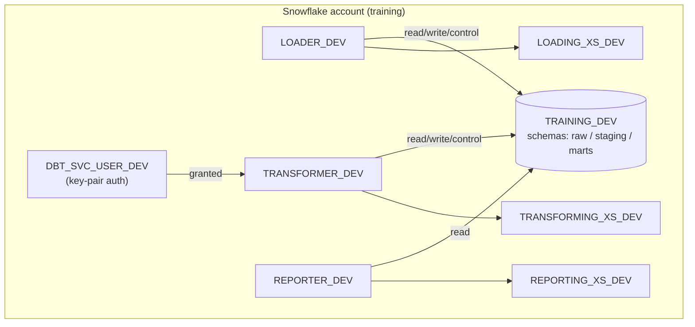

# Minimal training infrastructure — design

This is the complete design specification for the minimal, self-service training
infrastructure. It is detailed enough to implement without further design
decisions, and it is implemented as-is in
[`infra-template/`](https://github.com/cagov/caldata-mdsa-training/tree/main/infra-template).

It is a stripped-down, training-scoped version of the production
[caldata-infrastructure-template](https://github.com/cagov/caldata-infrastructure-template)
(which itself builds on [data-infrastructure](https://github.com/cagov/data-infrastructure)).
See [Manual vs. automated](manual-vs-automated.md) for how it compares and why each
element was simplified.

## Design goals

1. **Provisionable from a clean repository** with no cloud prerequisites beyond a
   Snowflake account and an admin role.
2. **Minimal** — the smallest architecture that still teaches role-based access
   control and an end-to-end ELT flow.
3. **Self-service** — a learner completes it with only the documented
   [administrator prerequisites](manual-vs-automated.md#administrator-prerequisites-pre-provisioned-done-once-before-learners-begin).
4. **Repeatable** — trivially torn down and re-created.

## Architecture overview



## 1. Terraform architecture

A single root configuration with three small modules and **local state** (no S3
backend, so nothing to pre-provision).

```
infra-template/terraform/
├── main.tf            # 4 provider aliases (public/sysadmin/securityadmin/useradmin) + training module
├── variables.tf       # account_name, organization_name, name_suffix, dbt_service_account_public_key
├── outputs.tf         # database_name, warehouse_names, role_names, dbt_service_user_name
├── terraform.tfvars.example
└── modules/
    ├── database/      # creates a DB + READ/READWRITE/READWRITECONTROL access roles + future grants
    ├── warehouse/     # creates a warehouse + a MONITOR/OPERATE/USAGE access role
    └── training/      # wires the simplified architecture together
```

**Provider model.** Snowflake makes the object *creator* the owner, so the design
uses role-scoped provider aliases and every resource declares the role it needs:

| Alias           | Role            | Creates                                    |
| --------------- | --------------- | ------------------------------------------ |
| (default)       | `PUBLIC`        | nothing (low-permission default)           |
| `sysadmin`      | `SYSADMIN`      | databases, warehouses                      |
| `securityadmin` | `SECURITYADMIN` | privilege grants, ownership grants         |
| `useradmin`     | `USERADMIN`     | roles, users, role grants                  |

**State.** Local `terraform.tfstate` (git-ignored). A team that wants shared state
can swap in an S3/Terraform Cloud backend, but training does not require it.

## 2. Required Snowflake objects

### Database (1)

`TRAINING_<ENV>` with `data_retention_time_in_days = 1`. The `database` module also
creates three access roles and future grants so anything dbt creates is
automatically governed:

- `TRAINING_<ENV>_READ` — `USAGE` on DB; `SELECT`/`REFERENCES` on future tables/views.
- `TRAINING_<ENV>_READWRITE` — adds DML on future tables.
- `TRAINING_<ENV>_READWRITECONTROL` — adds `CREATE SCHEMA`, object DDL, and
  ownership of future schemas/tables/views.

Schemas used by dbt: `raw` (seeds), `staging` (views), `marts` (tables). These are
created on demand by dbt using the `READWRITECONTROL` grant; they are not
pre-created in Terraform.

### Warehouses (3, all X-Small)

| Name                    | Purpose                | `auto_suspend` |
| ----------------------- | ---------------------- | -------------- |
| `LOADING_XS_<ENV>`      | loading raw data       | 60s            |
| `TRANSFORMING_XS_<ENV>` | dbt transformations    | 60s            |
| `REPORTING_XS_<ENV>`    | reporting / BI reads   | 60s            |

Each warehouse gets a `<NAME>_WH_MOU` access role (MONITOR/OPERATE/USAGE),
`auto_resume = true`, `initially_suspended = true`.

### Functional roles (3)

| Role              | Database access on `TRAINING_<ENV>` | Warehouse             |
| ----------------- | ----------------------------------- | --------------------- |
| `LOADER_<ENV>`    | READWRITECONTROL                    | `LOADING_XS_<ENV>`    |
| `TRANSFORMER_<ENV>` | READWRITECONTROL                  | `TRANSFORMING_XS_<ENV>` |
| `REPORTER_<ENV>`  | READ                                | `REPORTING_XS_<ENV>`  |

All three are granted to `SYSADMIN` so `SYSADMIN` can manage objects they own.

### Service account (1)

`DBT_SVC_USER_<ENV>`:

- `default_role = TRANSFORMER_<ENV>`, `default_warehouse = TRANSFORMING_XS_<ENV>`.
- `TRANSFORMER_<ENV>` granted to the user.
- `rsa_public_key = var.dbt_service_account_public_key` — **key-pair auth only**,
  no password.

## 3. Key-pair authentication

- Learner runs `scripts/generate_key_pair.sh <name> [passphrase]`, which produces
  an **encrypted PKCS#8 private key** (`.p8`) and a public key (`.pub`), and prints
  the public key as a single line (header/trailer/newlines stripped) ready for
  `terraform.tfvars`.
- The public key is applied to the service user **by Terraform**
  (`dbt_service_account_public_key`) — no manual `ALTER USER`.
- The **private key** is used two places, never committed:
  - Locally via `SNOWFLAKE_PRIVATE_KEY_PATH`.
  - In CI via the `SNOWFLAKE_PRIVATE_KEY` GitHub secret.

## 4. GitHub Actions workflows

Both live in `infra-template/.github/workflows/` and run on `pull_request` and
push to `main`:

| Workflow                   | Purpose                                                                 | Needs secrets |
| -------------------------- | ---------------------------------------------------------------------- | :-----------: |
| `terraform-validation.yml` | `terraform fmt -check`, `init -backend=false`, `validate`, `tflint`     | No            |
| `ci.yml`                   | `dbt deps` + `dbt build` against Snowflake as the dbt service user      | Yes           |

## 5. Required secrets and configuration

### Local (env vars, from `.env`)

`SNOWFLAKE_ACCOUNT`, `SNOWFLAKE_USER`, `SNOWFLAKE_PRIVATE_KEY_PATH`,
`SNOWFLAKE_PRIVATE_KEY_PASSPHRASE`, plus `SNOWFLAKE_ROLE`, `SNOWFLAKE_WAREHOUSE`,
`DBT_TRAINING_DB` for dbt runs.

### Terraform (`terraform.tfvars`)

`account_name`, `organization_name`, `name_suffix`, `dbt_service_account_public_key`.

### GitHub (repository Actions secrets/vars)

| Name                                | Kind   | Value                                   |
| ----------------------------------- | ------ | --------------------------------------- |
| `SNOWFLAKE_ACCOUNT`                 | var    | e.g. `MYORG-ABC12345`                   |
| `SNOWFLAKE_PRIVATE_KEY`             | secret | contents of the dbt service `.p8` key   |
| `SNOWFLAKE_PRIVATE_KEY_PASSPHRASE`  | secret | passphrase for that key (if encrypted)  |

## 6. Administrator vs. learner responsibilities

See the [decision matrix](manual-vs-automated.md#decision-matrix-administrator-vs-learner-responsibilities).
In short: the admin owns the Snowflake account, grants the learner an admin role,
sets account security, and publishes the template repo. The learner does
everything else via the template, scripts, and documented commands.

## 7. Complete setup workflow (new repo → working environment)

1. Learner creates a repo from the GitHub template.
2. Installs tooling: `terraform`, `uv`, `git` (+ `tflint`, `gh`).
3. `cp .env.example .env`, fills admin Snowflake creds, `source .env`.
4. `bash scripts/generate_key_pair.sh dbt_svc_dev` → copies the printed public key.
5. `cp terraform/terraform.tfvars.example terraform/terraform.tfvars`, fills values
   including the public key.
6. `cd terraform && terraform init && terraform apply`.
7. Sets GitHub secrets/vars (`gh secret set …`, `gh variable set …`).
8. `bash scripts/validate.sh`.
9. Pushes a branch / opens a PR → GitHub Actions run green.

Full commands are in the [setup guide](setup-guide.md).

## 8. Environment validation process

`bash scripts/validate.sh` runs these checks with a PASS/FAIL each:

1. `terraform fmt -check` + `terraform validate`.
2. Terraform outputs report 1 database, 3 warehouses, 3 roles.
3. `dbt parse` (offline structural check).
4. `dbt debug` — connection, DB, schema, warehouse, and role all reachable
   (proves objects exist and grants function).
5. `dbt build` — seed + models + tests, exercising read/write grants end to end.

Steps 4–5 auto-skip without credentials, so the script works locally and in CI.
`scripts/validate.sql` provides equivalent manual SHOW/USE checks for admins.

## 9. Cleanup / reset for repeatable training

- **Reset:** `cd terraform && terraform destroy` removes the database, warehouses,
  roles, and service user. Re-run `terraform apply` for a fresh environment.
- **Full teardown:** additionally delete the GitHub repository (or its Actions
  secrets) and, if the Snowflake account was training-only, drop the account.
- The training database uses a 1-day retention window (vs. 7 in production) to keep
  Time Travel storage — and therefore cost — minimal between resets.

## Done-when

- The design completely specifies the minimal training infrastructure and is
  implemented in `infra-template/` with no additional design decisions required.
